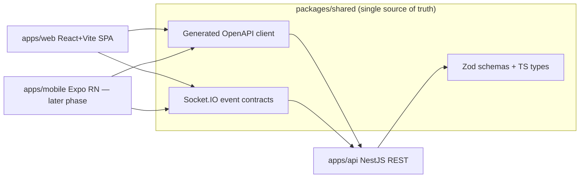
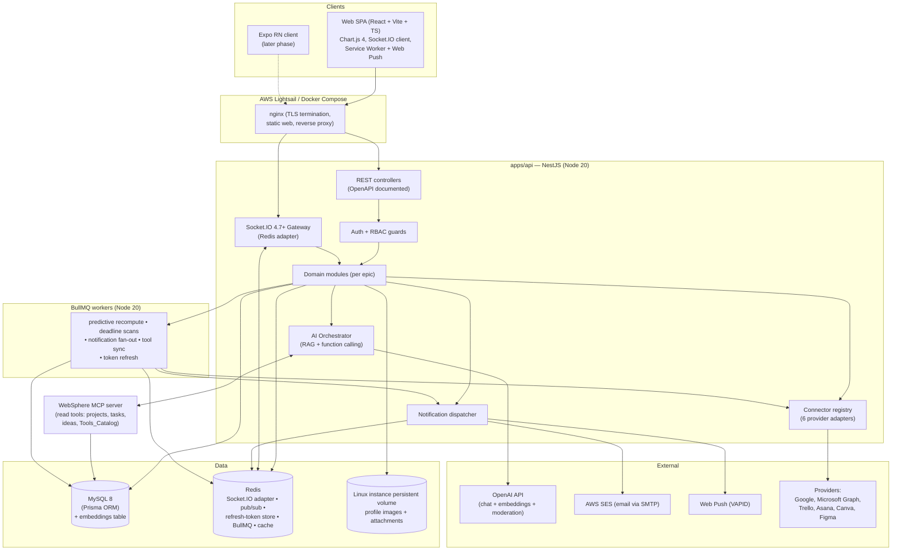
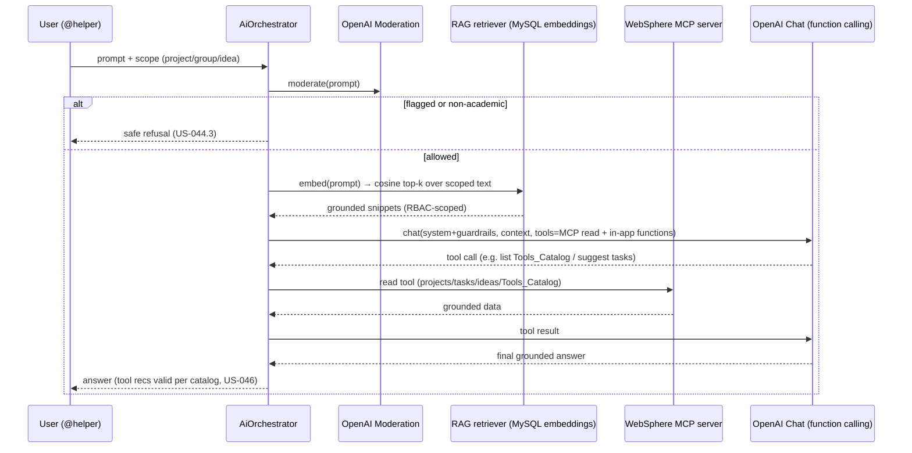
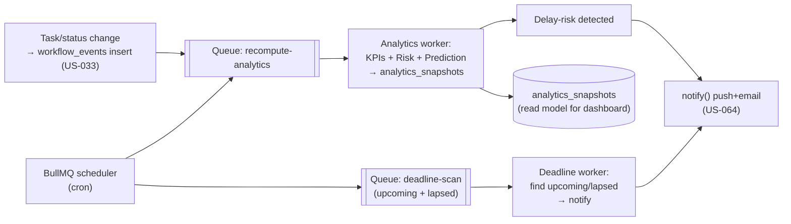
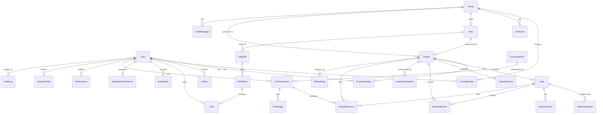

# Design Document

## Overview

WebSphere is a web-first, API-first academic project and idea management platform for STI College student teams. It takes a group from raw ideas (submitted, refined, and voted in a real-time collaboration hub) through to a running academic project with automatically tracked tasks, explainable predictive monitoring, an academic AI assistant, and deep integrations with six external productivity/design tool families.

This design realizes all 13 epics and 75 user stories (US-001 through US-075) plus the platform non-functional requirements. It is deliberately implementation-oriented: it names the concrete modules, endpoints, Socket.IO events, Prisma models, background jobs, and quantitative formulas the build must produce.

### Goals

- **API-first, web-first.** Every capability is a documented REST endpoint (OpenAPI) plus, where interactive, a Socket.IO event. The React (Vite) SPA is one client; it holds no business logic that the API does not also enforce.
- **Enable the later Expo client without rework.** All business rules, authorization, validation, and real-time contracts live in `apps/api` and are described by shared Zod schemas/types in `packages/shared`. A future `apps/mobile` (Expo/React Native) consumes the same generated client, the same Socket.IO events, and the same auth flows. Only presentation differs. Web push (VAPID) and Expo push are two adapters behind one notification port.
- **Automatic, not manual, tracking.** Progress, KPIs, and predictions are pure functions of `workflow_events` + task data. There is no manual progress-percentage input path anywhere (US-031 is excluded by design).
- **Explainable analytics.** Predictive monitoring is a transparent, quantitative model with named KPIs and contributing factors — never a black box (US-053–061).
- **Grounded, guarded AI.** The OpenAI assistant is grounded via RAG over project/group/task/idea text and via an MCP server that exposes read-only catalog/data tools, kept inside the caller's RBAC scope, academic-only, and degradable when OpenAI is unavailable.

### How web-first / API-first enables the Expo phase



Because the SPA and the future Expo app both depend on `packages/shared`, adding the mobile client is a matter of building React Native screens against contracts that already exist and are already tested. The API, auth, real-time, notifications (push abstracted over VAPID today, Expo push later), and AI surfaces do not change.

### Scope boundaries honored by this design

- Manual task progress entry (US-031) has **no** interface or API.
- Multimodal AI is not implemented; the assistant is text-only (US-039/044).
- WebRTC audio/video (US-016.3) and the Expo client are later phases; only their enabling architecture (Socket.IO signaling seam, shared contracts) is present.
- No institutional-system integration, no offline mode, no 2FA.

---

## Architecture

### System architecture diagram



### Monorepo layout (pnpm + Turborepo)

```
websphere/
├─ apps/
│  ├─ web/          # React + Vite SPA (TypeScript), Chart.js 4, Socket.IO client, SW + web push
│  ├─ api/          # NestJS REST + Socket.IO gateway + BullMQ producers (TypeScript)
│  ├─ worker/       # BullMQ worker process (shares api domain services)
│  ├─ mcp/          # WebSphere MCP server (read-only tools) — Node 20
│  └─ mobile/       # RESERVED — Expo (React Native), later phase
├─ packages/
│  └─ shared/       # TS types, Zod schemas, generated OpenAPI client, Socket.IO event contracts
├─ prisma/          # schema.prisma, migrations, seed
├─ docker/          # Dockerfiles + docker-compose.yml (api, worker, web+nginx, mysql, redis, mcp)
├─ turbo.json
└─ pnpm-workspace.yaml
```

`apps/worker` imports the same NestJS domain services as `apps/api` (a shared Nest application context without HTTP listeners), so job logic and request logic never diverge.

### Backend modules mapped to epics

Each module is a NestJS feature module with its own controller(s), service(s), Prisma access, and (where relevant) a Socket.IO namespace and BullMQ producers.

| Module | Epic / User stories | Responsibility |
|---|---|---|
| `AuthModule` | Epic 1 (US-002/003/006/007), NFR sec | Login, admin login, JWT issue/verify, refresh rotation + token versioning in Redis, logout invalidation, password policy, lockout + reset links |
| `UsersModule` | Epic 1 (US-001/004/005) | Registration, RBAC role assignment, profile CRUD, profile image upload to the Linux instance persistent volume |
| `AdminModule` | Epic 13 (US-072–075) | Monitoring dashboard, account lifecycle, audit/log review, system settings, maintenance mode |
| `DashboardModule` | Epic 2 (US-008–011) | Aggregated dashboard summary, glance counts, group-scoped online users, previews |
| `GroupsModule` | Epic 3 (US-012–018) | Group create/join (join codes), membership + roles, collaboration hub, idea→project kickoff |
| `ChatModule` | Epic 3 (US-016) | Real-time group chat, retained history, presence; WebRTC signaling seam (later) |
| `ProjectsModule` | Epic 4 (US-019–025) | Project CRUD, membership, deadline/status, team responsibilities, progress read model |
| `TasksModule` | Epic 5 (US-026–035) | Task CRUD, assignment, status changes, task tracker, live updates |
| `WorkflowModule` | Epic 5/9 (US-033, US-053–061) | Workflow event recording, KPI computation, predictive monitoring, recommendations |
| `IdeasModule` | Epic 6 (US-036–043) | Idea CRUD, refinement, polls, voting, results, finalize/convert |
| `AiModule` | Epic 7 (US-039/040, US-044–047) | AI orchestrator: RAG retrieval, MCP tool calls, function calling, moderation, @helper |
| `CalendarModule` | Epic 8 (US-048–052) | Calendar events, project/task date projection, upcoming schedules |
| `NotificationsModule` | Epic 10 (US-062–066) | Notification center, in-app dispatch, email/push, preferences |
| `IntegrationsModule` | Epic 11 (US-067–069) | Tools catalog, Connector registry, OAuth2, encrypted tokens, link/launch, sync |
| `SupportModule` | Epic 12 (US-070/071) | Support tickets, admin processing |
| `RealtimeModule` | NFR real-time | Socket.IO gateway, Redis adapter, presence registry, room management |
| `JobsModule` | NFR real-time #8 | BullMQ queues, schedulers, worker wiring |
| `SharedInfra` | cross-cutting | Prisma service, Redis service, config, crypto (AES-GCM), local Linux-volume storage, OpenAPI |

---

## Components and Interfaces

Types below are illustrative TypeScript signatures that live in `apps/api` (services/controllers) or `packages/shared` (contracts). They show intended shape and low-level detail, not final code.

### Cross-cutting contracts (`packages/shared`)

```ts
export type Role = 'Administrator' | 'Project_Leader' | 'Project_Member';

// Every REST error uses this envelope.
export interface ApiError {
  code: string;              // e.g. 'AUTH_INVALID_CREDENTIALS', 'RBAC_FORBIDDEN'
  message: string;
  fields?: Record<string, string>; // field-level validation messages (US-001/005/006)
}

// Socket.IO event contract registry (typed both ends).
export interface ServerToClientEvents {
  'chat:message':        (m: ChatMessageDto) => void;              // US-016
  'presence:update':     (p: PresenceDto) => void;                 // US-008
  'task:updated':        (t: TaskDto) => void;                     // US-035
  'poll:tally':          (p: PollTallyDto) => void;                // US-042
  'notification:new':    (n: NotificationDto) => void;             // US-062/063
  'activity:new':        (a: ActivityDto) => void;                 // feeds
  'sync:reconcile':      (s: ReconcileDto) => void;                // US-035.2 / NFR-18
}
export interface ClientToServerEvents {
  'chat:send':      (m: SendMessageDto, ack: (r: AckDto) => void) => void;
  'group:join':     (groupId: string, ack: (r: AckDto) => void) => void;
  'project:join':   (projectId: string, ack: (r: AckDto) => void) => void;
  'sync:request':   (cursor: SyncCursorDto, ack: (r: ReconcileDto) => void) => void;
}
```

### AuthModule (Epic 1 — US-002/003/006/007)

```ts
interface JwtAccessPayload { sub: string; role: Role; tv: number; } // tv = token version (US-007)

interface AuthService {
  login(email: string, password: string): Promise<{ access: string; refresh: string } | LockoutError>;
  adminLogin(email: string, password: string): Promise<{ access: string; refresh: string }>; // US-003
  refresh(refreshToken: string): Promise<{ access: string; refresh: string }>; // rotates + bumps store
  logout(userId: string, refreshJti: string): Promise<void>; // deletes refresh jti, bumps tv, clears cache
  guidedReset(userId: string, oldPw: string, newPw: string, confirm: string): Promise<void>; // US-006.3/4
  requestLockedReset(email: string): Promise<void>; // US-006.5 emails reset link
  completeLockedReset(token: string, newPw: string, confirm: string): Promise<void>;
}

// Pure, unit- and property-testable. No 2FA (US-006.6).
function validatePassword(pw: string): { ok: boolean; reason?: string };
// Rules: length >= 8; >= 1 symbol; >= 1 number; symbol/number not "continuous";
// reject monotonic sequences (e.g. "AbCd1234", "1234", "abcd"). US-006.1/2
```

Token model: short-lived JWT access (payload carries `tv`), long-lived refresh stored by `jti` in Redis. Each user has a `tokenVersion` in Redis; guards reject any access token whose `tv` mismatches. Logout deletes the refresh `jti` and increments `tokenVersion`, which simultaneously invalidates the session and cached session data (US-007.1/2/3). Lockout counter (failed attempts) lives in Redis with a TTL; hitting the threshold flips the account to locked and forces the email-reset path (US-006.5).

RBAC is enforced by a global `JwtAuthGuard` plus a `RolesGuard` reading `@Roles()` metadata, and project/group-scoped guards (`@ProjectRole('Project_Leader')`) that check membership rows, not just the primary role (US-004, US-015, US-022, US-027, US-038, US-051).

Key REST endpoints:

```
POST /auth/register            (US-001)
POST /auth/login               (US-002)
POST /auth/admin/login         (US-003)
POST /auth/refresh
POST /auth/logout              (US-007)
POST /auth/password/change     (US-006 guided reset)
POST /auth/password/forgot     (US-006 locked-out email link)
POST /auth/password/reset      (complete reset via token)
```

### UsersModule (Epic 1 — US-001/004/005)

```
POST /users                    (register → Project_Member)  (US-001)
GET  /users/me                 (US-005)
PATCH /users/me                (name/email/institution/course)  (US-005)
POST /users/me/avatar          (upload → Linux instance persistent volume)  (US-005)
```

### GroupsModule + ChatModule (Epic 3 — US-012–018)

```ts
interface GroupsService {
  create(userId: string, name: string): Promise<Group>;      // creator becomes Project_Leader (US-012/019)
  joinByCode(userId: string, code: string): Promise<Group>;  // validates + expiry (US-012.2/3)
  listForUser(userId: string): Promise<GroupWithRole[]>;     // US-013
  details(userId: string, groupId: string): Promise<GroupDetails>; // membership-gated (US-014)
  addMember(actorId: string, groupId: string, userId: string): Promise<void>;   // any member (US-015.1)
  removeMember(actorId: string, groupId: string, userId: string): Promise<void>;// leader-only (US-015.2/3)
  beginProjectFromIdea(actorId: string, groupId: string, ideaId: string): Promise<Project>; // US-018
}
```

```
POST /groups                          (US-012)
POST /groups/join                     (US-012)
GET  /groups                          (US-013)
GET  /groups/:id                      (US-014)
POST /groups/:id/members              (US-015.1)
DELETE /groups/:id/members/:userId    (US-015.2 leader-only)
GET  /groups/:id/hub                  (US-017 collaboration hub aggregate)
POST /groups/:id/ideas/:ideaId/begin  (US-018)
```

Chat (Socket.IO namespace `/chat`, room per group): `chat:send` → persist message → broadcast `chat:message` to the group room (US-016.1). History via `GET /groups/:id/messages?cursor=` (US-016.2). Presence tracked in Redis, emitted as `presence:update`, filtered to the caller's group (US-008.2). WebRTC signaling events are reserved on the same namespace for the later phase (US-016.3).

### ProjectsModule (Epic 4 — US-019–025)

```
POST /projects                    (US-019, creator → Project_Leader)
GET  /projects                    (US-020)
GET  /projects/:id                (US-021, member-gated)
PATCH /projects/:id               (US-022 leader-only)
PATCH /projects/:id/status        (US-023)
GET  /projects/:id/team           (US-024)
GET  /projects/:id/progress       (US-025 computed read model)
```

Progress is never stored as an authoritative field a user edits; it is computed by `WorkflowModule` from tasks + workflow events and returned by `/progress` (US-025.1, US-031, US-032, NFR-15).

### TasksModule (Epic 5 — US-026–035)

```ts
interface TasksService {
  create(actorId: string, projectId: string, dto: CreateTaskDto): Promise<Task>; // leader (US-026)
  update(actorId: string, taskId: string, dto: UpdateTaskDto): Promise<Task>;     // leader (US-026)
  assign(actorId: string, taskId: string, assigneeId: string): Promise<Task>;     // eligible-member check (US-027)
  changeStatus(actorId: string, taskId: string, status: TaskStatus): Promise<Task>; // assignee (US-030)
  // No setProgress method exists anywhere — US-031 excluded by design.
}
type TaskStatus = 'pending' | 'ongoing' | 'completed';
```

```
POST  /projects/:id/tasks             (US-026)
PATCH /tasks/:id                      (US-026)
POST  /tasks/:id/assign               (US-027, notifies assignee)
GET   /tasks/mine                     (US-028, filter/sort by project/deadline/priority/status)
GET   /tasks/:id                      (US-029, project-member gated)
PATCH /tasks/:id/status               (US-030)
GET   /projects/:id/tasks/tracker     (US-032 counts + derived %)
GET   /projects/:id/tasks/by-member   (US-034)
```

Every status/assignment change: (1) writes a `workflow_events` row (US-033), (2) emits `task:updated` to the project room (US-035.1), (3) enqueues notification fan-out and predictive recompute. On reconnect, the client sends `sync:request` with its last cursor and receives `sync:reconcile` with the authoritative current task states (US-035.2, NFR-18).

### IdeasModule (Epic 6 — US-036–043)

```ts
interface IdeasService {
  submit(userId: string, groupId: string, dto: IdeaDto): Promise<Idea>;   // member-gated (US-036)
  list(userId: string, groupId: string): Promise<Idea[]>;                 // author + status (US-037)
  revise(userId: string, ideaId: string, dto: IdeaDto): Promise<Idea>;    // author-only, pre-selection (US-038)
  openPoll(userId: string, groupId: string, ideaIds: string[]): Promise<IdeaPoll>; // (US-041)
  vote(userId: string, pollId: string, optionId: string): Promise<PollTally>; // one vote/eligible member (US-041)
  results(userId: string, pollId: string): Promise<PollTally>;            // (US-042)
  finalize(actorId: string, pollId: string): Promise<Project>;            // leader → project (US-043/018)
}
```

Voting uses a unique constraint `(pollId, voterId)` so a member's vote is counted exactly once; re-voting updates the existing row rather than inserting (US-041). After each vote, the recomputed tally is broadcast as `poll:tally` to the group room (US-042.2). `finalize`/`beginProjectFromIdea` create the project and write an immutable `idea.projectId` link preserving the idea→project relationship (US-018/043).

AI review actions never mutate the idea automatically: `POST /ideas/:id/ai/suggest` returns suggestions; the author applies them via `PATCH /ideas/:id` with explicit accept/revise, so the system applies only the author-selected action (US-039/040).

### AiModule — RAG + MCP + function calling orchestration (Epic 7)

```ts
interface AiOrchestrator {
  ask(ctx: CallerContext, prompt: string, scope: AiScope): Promise<AiAnswer>;
}
interface CallerContext { userId: string; role: Role; projectId?: string; groupId?: string; }
```

Orchestration flow for an `@helper` invocation:



- **RAG store:** `embeddings` table in MySQL holds vectors for project/group/task/idea text; retrieval computes cosine similarity in the API at capstone scale. Documented as swappable for a dedicated vector store (e.g., Qdrant) behind an `EmbeddingStore` interface at larger scale.
- **MCP server (`apps/mcp`):** exposes read-only tools — `listProjects`, `listTasks`, `listIdeas`, `getToolsCatalog` — so tool/feature recommendations are grounded and valid (US-046). MCP calls run inside the caller's RBAC scope (the orchestrator passes scoped filters; the MCP server never returns rows outside them).
- **Function calling:** controlled in-app actions (e.g., suggest tasks for a plan, merge ideas) execute only within the caller's RBAC permissions and never bypass service-layer authorization.
- **Guardrails:** system prompt enforces academic-only usage; OpenAI moderation screens input; multimodal input is rejected (US-039.2/044.2/044.3).
- **Graceful degradation:** if OpenAI is unreachable, `AiModule` returns a typed `AI_UNAVAILABLE` response and the SPA hides/disables AI affordances while all core features continue (NFR-14).

```
POST /ai/ask                 (US-044)
POST /ai/ideas/generate      (US-045, incl. merge)
POST /ai/recommendations     (US-046, catalog-grounded)
POST /ai/planning            (US-047)
POST /ideas/:id/ai/suggest   (US-039/040)
```

### CalendarModule (Epic 8 — US-048–052)

```
GET    /calendar?from=&to=       (US-048/049 events + projected project/task dates)
POST   /calendar/events          (US-050, optional project link)
PATCH  /calendar/events/:id      (US-051, project-event auth)
DELETE /calendar/events/:id      (US-051)
GET    /calendar/upcoming        (US-052 with urgency)
```

Project deadlines and task timelines are projected onto the calendar as colored, clickable hints derived live from `projects`/`tasks` (US-049), not duplicated as events. Upcoming/lapsed deadlines trigger push+email via the notification pipeline (US-052.2).

### NotificationsModule — notification pipeline (Epic 10 — US-062–066)

```ts
interface NotificationPort { deliver(n: PreparedNotification): Promise<DeliveryResult>; }
class InAppChannel  implements NotificationPort {} // persist + emit 'notification:new'
class EmailChannel  implements NotificationPort {} // AWS SES via nodemailer SMTP
class WebPushChannel implements NotificationPort {} // VAPID + service worker
// ExpoPushChannel — reserved for mobile phase, same port.

interface NotificationService {
  notify(userIds: string[], type: NotificationType, payload: NotificationPayload): Promise<void>;
}
```

Pipeline: a domain event (task assigned, project change, deadline approaching/lapsed, delay-risk alert, announcement) calls `notify()`. The service persists a `notifications` row (US-062), then consults per-type `notification_preferences` (US-066) to select channels. In-app always emits `notification:new` for connected users; email (SES) and web push (VAPID) fire for supported types and especially for upcoming AND lapsed deadlines and delay-risk alerts, even when the app is closed (US-052/064/065). Fan-out to many recipients runs on a BullMQ queue.

```
GET   /notifications                 (US-062 center: message, ts, type, read)
PATCH /notifications/:id/read
GET   /notifications/preferences     (US-066)
PUT   /notifications/preferences     (tasks, deadlines, group activity, AI suggestions)
POST  /push/subscribe                (store VAPID subscription)
```

### IntegrationsModule — Connector interface (Epic 11 — US-067–069)

```ts
interface Connector {
  readonly provider: ProviderId; // 'google'|'microsoft'|'trello'|'asana'|'canva'|'figma'
  authorizeUrl(state: string, redirectUri: string): string;              // OAuth2 start
  exchangeCode(code: string, redirectUri: string): Promise<OAuthTokens>; // → encrypted at rest
  refresh(tokens: OAuthTokens): Promise<OAuthTokens>;                    // where supported
  sync(conn: ToolConnection): Promise<SyncResult>;                       // US-069
  link(conn: ToolConnection, target: LinkTarget): Promise<LinkedResource>; // US-068.1
  launchUrl(resource: LinkedResource): Promise<string>;                  // deep link (US-068.2)
}
```

All six families (Google Drive/Docs, Microsoft 365 via Graph, Trello, Asana, Canva, Figma) are fully implemented as per-provider adapters behind this common interface, registered in a `ConnectorRegistry`. OAuth2 tokens are encrypted with AES-GCM (key from env/secret) before persistence and decrypted only in-adapter (NFR-3). Where a provider supports refresh tokens, a BullMQ job refreshes them before expiry; where it does not, the connection is flagged and the user is prompted to reconnect. Connected-tool usage is recorded and surfaced to analytics (US-053/069).

```
GET    /integrations/catalog             (US-067.1 supported tools)
GET    /integrations/:provider/authorize (US-067.2 OAuth2 start)
GET    /integrations/:provider/callback
POST   /integrations/:provider/link      (US-068.1 link to project/task)
GET    /integrations/links/:id/launch    (US-068.2 deep link)
GET    /integrations/connections         (US-069 status + sync activity)
POST   /integrations/connections/:id/sync
```

### WorkflowModule — predictive-monitoring job pipeline (Epic 5/9)



The predictive model is explainable and quantitative. All formulas are pure functions of workflow/task data and are unit- and property-testable:

```ts
// completed / total  (US-053)
taskCompletionRate = completed / max(total, 1);

// on-time completed / total completed  (US-053)
overallEfficiency = onTimeCompleted / max(totalCompleted, 1);

// Per member (US-055)
memberPerformance = {
  tasksCompleted,
  onTimePct: memberOnTime / max(memberCompleted, 1),
  avgCycleTime,                 // mean(completedAt - startedAt)
  contributionShare,            // memberCompleted / groupCompleted
};

// Bottleneck (US-056)
bottleneck = {
  expectedDuration, actualDuration,
  delayDays: max(0, actualDuration - expectedDuration),
  blastRadius: countDependentDownstreamTasks + countAffectedMembers, // Blast_Radius
};

// Risk_Score 0..100  (US-059) — weighted, normalized blend
riskScore = clamp(0, 100,
  w1 * remainingWorkVsTimeLeft +   // remaining tasks vs time to deadline
  w2 * (1 - normalizedVelocity) +  // slower team velocity → higher risk
  w3 * normalizedOverdueBlocked);  // overdue + blocked count
// Risk_Level thresholds (monotonic in riskScore):
riskLevel = riskScore < 40 ? 'on-track' : riskScore <= 70 ? 'at-risk' : 'critical';

// Predicted completion date (US-060)
velocity = completedTasksInWindow / windowDays;      // recent completion velocity
predictedDate = now + ceil(remainingTasks / max(velocity, epsilon)) days;
deltaVsDeadline = predictedDate - originalDeadline;  // + contributing factors

// Corrective recommendations mapped to the risk/bottleneck they address (US-061)
recommendations = mapRiskToActions(riskLevel, bottlenecks); // adjust deadline / reassign / add support / schedule review
```

```
GET /projects/:id/analytics           (US-053 dashboard aggregate)
GET /projects/:id/analytics/trends     (US-054)
GET /projects/:id/analytics/members    (US-055)
GET /projects/:id/analytics/bottlenecks(US-056)
GET /projects/:id/analytics/summary    (US-057)
GET /projects/:id/risk                 (US-058/059)
GET /projects/:id/prediction           (US-060)
GET /projects/:id/recommendations      (US-061)
```

The web dashboard renders these with Chart.js 4.

### AdminModule + SupportModule (Epics 12–13 — US-070–075)

```
POST  /support/tickets                 (US-070 category required)
GET   /admin/support/tickets           (US-071)
PATCH /admin/support/tickets/:id       (respond + status)
GET   /admin/monitoring                (US-072 metrics/health)
GET   /admin/users                     (US-073)
PATCH /admin/users/:id                 (edit/deactivate/remove/reactivate/suspend)
GET   /admin/logs                      (US-074 time/activity/module/severity/description)
GET   /admin/settings                  (US-075)
PUT   /admin/settings                  (notification rules, inactivity, maintenance mode)
```

---

## Data Models

### Entity-relationship diagram



### Prisma-style model definitions

```prisma
// ---------- Users, roles, admins ----------
enum Role { Administrator Project_Leader Project_Member }
enum AccountStatus { active suspended deactivated removed locked }

model User {
  id            String   @id @default(cuid())
  email         String   @unique
  passwordHash  String
  fullName      String
  institution   String?
  course        String?
  avatarUrl     String?               // Linux instance persistent volume URL (US-005)
  role          Role     @default(Project_Member) // primary role (US-004.1)
  status        AccountStatus @default(active)
  tokenVersion  Int      @default(0)  // mirror of Redis; forces re-auth (US-007)
  failedLogins  Int      @default(0)
  lockedAt      DateTime?
  createdAt     DateTime @default(now())
  groupMembers  GroupMember[]
  projectMembers ProjectMember[]
  admin         Admin?
  notifications Notification[]
  preference    NotificationPreference?
  toolConnections ToolConnection[]
  votes         Vote[]
  aiInteractions AiInteraction[]
  supportTickets SupportTicket[]
}

model Admin {
  id        String @id @default(cuid())
  userId    String @unique
  user      User   @relation(fields: [userId], references: [id])
  portalLevel String @default("standard")
}

// ---------- Groups, membership, join codes ----------
enum ProjectRole { Project_Leader Project_Member }

model Group {
  id        String   @id @default(cuid())
  name      String
  createdBy String
  createdAt DateTime @default(now())
  members   GroupMember[]
  joinCodes JoinCode[]
  ideas     Idea[]
  projects  Project[]
  messages  ChatMessage[]
}

model GroupMember {
  id       String      @id @default(cuid())
  groupId  String
  userId   String
  role     ProjectRole @default(Project_Member) // leader vs member (US-013)
  joinedAt DateTime    @default(now())
  group    Group @relation(fields: [groupId], references: [id])
  user     User  @relation(fields: [userId], references: [id])
  @@unique([groupId, userId])
}

model JoinCode {
  id        String   @id @default(cuid())
  groupId   String
  code      String   @unique      // Google-Meet-style (US-012)
  expiresAt DateTime?
  active    Boolean  @default(true)
  group     Group @relation(fields: [groupId], references: [id])
}

model ChatMessage {                 // retained history (US-016.2)
  id        String   @id @default(cuid())
  groupId   String
  senderId  String
  body      String   @db.Text
  createdAt DateTime @default(now())
  group     Group @relation(fields: [groupId], references: [id])
  @@index([groupId, createdAt])
}

// ---------- Projects, membership, tasks ----------
enum ProjectStatus { active completed archived on_hold }
enum TaskStatus { pending ongoing completed }
enum TaskPriority { low medium high }

model Project {
  id          String   @id @default(cuid())
  groupId     String
  ideaId      String?  @unique      // idea→project link preserved (US-018/043)
  title       String
  description String   @db.Text
  startDate   DateTime?
  deadline    DateTime?
  status      ProjectStatus @default(active)
  createdBy   String                 // becomes Project_Leader (US-019.4)
  createdAt   DateTime @default(now())
  group       Group @relation(fields: [groupId], references: [id])
  idea        Idea? @relation(fields: [ideaId], references: [id])
  members     ProjectMember[]
  tasks       Task[]
  events      CalendarEvent[]
  workflow    WorkflowEvent[]
  snapshots   AnalyticsSnapshot[]
  linkedResources LinkedResource[]
  embeddings  Embedding[]
}

model ProjectMember {
  id        String      @id @default(cuid())
  projectId String
  userId    String
  role      ProjectRole @default(Project_Member)
  responsibility String?             // team responsibilities (US-024)
  project   Project @relation(fields: [projectId], references: [id])
  user      User    @relation(fields: [userId], references: [id])
  @@unique([projectId, userId])
}

model Task {
  id          String   @id @default(cuid())
  projectId   String
  title       String
  description String   @db.Text
  deadline    DateTime?
  priority    TaskPriority @default(medium)
  status      TaskStatus   @default(pending) // derived progress from status, no manual % (US-031)
  createdBy   String
  startedAt   DateTime?
  completedAt DateTime?
  expectedDurationHrs Float?          // for bottleneck expected-vs-actual (US-056)
  createdAt   DateTime @default(now())
  project     Project @relation(fields: [projectId], references: [id])
  assignments TaskAssignment[]
  comments    TaskComment[]
  workflow    WorkflowEvent[]
  dependsOn   TaskDependency[] @relation("dependent")
  dependents  TaskDependency[] @relation("prerequisite")
  linkedResources LinkedResource[]
  @@index([projectId, status])
}

model TaskDependency {               // supports Blast_Radius downstream count (US-056)
  id            String @id @default(cuid())
  prerequisiteId String
  dependentId    String
  prerequisite  Task @relation("prerequisite", fields: [prerequisiteId], references: [id])
  dependent     Task @relation("dependent", fields: [dependentId], references: [id])
  @@unique([prerequisiteId, dependentId])
}

model TaskAssignment {
  id         String   @id @default(cuid())
  taskId     String
  assigneeId String
  assignerId String
  assignedAt DateTime @default(now())
  active     Boolean  @default(true) // reassign flips active (US-027)
  task       Task @relation(fields: [taskId], references: [id])
  @@index([assigneeId, active])
}

model TaskComment {
  id        String   @id @default(cuid())
  taskId    String
  authorId  String
  body      String   @db.Text
  createdAt DateTime @default(now())
  task      Task @relation(fields: [taskId], references: [id])
}

// ---------- Workflow recording (US-033) ----------
enum WorkflowEventType { status_change task_completed assignment_change progress_activity }

model WorkflowEvent {
  id        String   @id @default(cuid())
  projectId String
  taskId    String?
  actorId   String
  type      WorkflowEventType
  fromValue String?
  toValue   String?
  createdAt DateTime @default(now())  // automatic, immutable audit of activity
  project   Project @relation(fields: [projectId], references: [id])
  task      Task?   @relation(fields: [taskId], references: [id])
  @@index([projectId, createdAt])
}

// ---------- Ideas, polls, votes ----------
enum IdeaStatus { submitted refined selected rejected }

model Idea {
  id        String   @id @default(cuid())
  groupId   String
  authorId  String
  title     String
  body      String   @db.Text
  status    IdeaStatus @default(submitted)
  createdAt DateTime @default(now())
  group     Group @relation(fields: [groupId], references: [id])
  polls     IdeaPoll[]
  project   Project?
}

model IdeaPoll {
  id        String   @id @default(cuid())
  groupId   String
  ideaId    String?                   // optional anchor idea
  createdBy String
  open      Boolean  @default(true)
  createdAt DateTime @default(now())
  idea      Idea? @relation(fields: [ideaId], references: [id])
  options   PollOption[]
}

model PollOption {
  id       String @id @default(cuid())
  pollId   String
  ideaId   String                      // each option references a candidate idea
  label    String
  poll     IdeaPoll @relation(fields: [pollId], references: [id])
  votes    Vote[]
}

model Vote {
  id        String   @id @default(cuid())
  pollId    String
  optionId  String
  voterId   String
  createdAt DateTime @default(now())
  option    PollOption @relation(fields: [optionId], references: [id])
  voter     User       @relation(fields: [voterId], references: [id])
  @@unique([pollId, voterId])          // exactly one vote per member per poll (US-041)
}

// ---------- Calendar ----------
enum CalendarEventType { meeting work_session presentation activity }

model CalendarEvent {
  id        String   @id @default(cuid())
  ownerId   String
  projectId String?                    // optional project link (US-050.2)
  title     String
  type      CalendarEventType
  startAt   DateTime
  endAt     DateTime?
  createdAt DateTime @default(now())
  project   Project? @relation(fields: [projectId], references: [id])
  @@index([ownerId, startAt])
}

// ---------- Notifications ----------
enum NotificationType { task_assignment task_update project_change group_activity announcement deadline_reminder delay_risk ai_suggestion }

model Notification {
  id        String   @id @default(cuid())
  userId    String
  type      NotificationType
  message   String
  relatedId String?                    // deep-link target (US-063.2)
  relatedType String?
  read      Boolean  @default(false)
  createdAt DateTime @default(now())
  user      User @relation(fields: [userId], references: [id])
  @@index([userId, read, createdAt])
}

model NotificationPreference {
  id        String  @id @default(cuid())
  userId    String  @unique
  tasks     Boolean @default(true)
  deadlines Boolean @default(true)
  groupActivity Boolean @default(true)
  aiSuggestions Boolean @default(true) // covers preference set (US-066.2)
  emailEnabled  Boolean @default(true)
  pushEnabled   Boolean @default(true)
  user      User @relation(fields: [userId], references: [id])
}

model PushSubscription {              // VAPID web push
  id        String @id @default(cuid())
  userId    String
  endpoint  String @db.Text
  p256dh    String
  auth      String
  createdAt DateTime @default(now())
  @@index([userId])
}

// ---------- Connected tools / integrations ----------
enum ProviderId { google microsoft trello asana canva figma }
enum ConnectionStatus { connected expired revoked error }

model ConnectedTool {                 // Tools_Catalog entry (US-067)
  id        String @id @default(cuid())
  provider  ProviderId @unique
  name      String
  category  String                    // collaboration/file/communication/academic
  connections ToolConnection[]
}

model ToolConnection {
  id             String @id @default(cuid())
  userId         String
  provider       ProviderId
  status         ConnectionStatus @default(connected)
  encAccessToken String @db.Text     // AES-GCM ciphertext (NFR-3) — never plaintext
  encRefreshToken String? @db.Text
  iv             String              // AES-GCM nonce
  authTag        String              // AES-GCM auth tag
  expiresAt      DateTime?
  lastSyncedAt   DateTime?
  syncState      String?             // last SyncResult summary (US-069)
  user           User @relation(fields: [userId], references: [id])
  tool           ConnectedTool @relation(fields: [provider], references: [provider])
  linkedResources LinkedResource[]
  usage          ToolUsage[]
  @@unique([userId, provider])
}

model LinkedResource {               // link/launch (US-068)
  id           String @id @default(cuid())
  connectionId String
  projectId    String?
  taskId       String?
  externalId   String
  externalUrl  String @db.Text        // deep link (US-068.2)
  title        String
  connection   ToolConnection @relation(fields: [connectionId], references: [id])
  project      Project? @relation(fields: [projectId], references: [id])
  task         Task?    @relation(fields: [taskId], references: [id])
}

model ToolUsage {                     // feeds analytics (US-053/069)
  id           String @id @default(cuid())
  connectionId String
  action       String                 // linked/launched/synced
  createdAt    DateTime @default(now())
  connection   ToolConnection @relation(fields: [connectionId], references: [id])
}

// ---------- AI ----------
model AiInteraction {
  id          String   @id @default(cuid())
  userId      String
  scopeType   String?                  // project/group/idea
  scopeId     String?
  prompt      String   @db.Text
  response    String   @db.Text
  moderated   Boolean  @default(false) // flagged/refused (US-044.3)
  createdAt   DateTime @default(now())
  user        User @relation(fields: [userId], references: [id])
}

model Embedding {                      // RAG store (swappable for Qdrant)
  id        String @id @default(cuid())
  projectId String?
  sourceType String                    // project/group/task/idea
  sourceId   String
  content    String @db.Text
  vector     Bytes                     // serialized float32[]; cosine in API at capstone scale
  createdAt  DateTime @default(now())
  project    Project? @relation(fields: [projectId], references: [id])
  @@index([sourceType, sourceId])
}

// ---------- Analytics / predictive snapshots ----------
enum RiskLevel { on_track at_risk critical }

model AnalyticsSnapshot {             // read model for dashboard (US-053-061)
  id            String @id @default(cuid())
  projectId     String
  taskCompletionRate Float
  overallEfficiency  Float
  riskScore     Float                  // 0..100 (US-059)
  riskLevel     RiskLevel
  predictedCompletion DateTime?        // (US-060)
  deltaDays     Int?                   // predicted vs deadline
  bottlenecks   Json                   // [{taskId, expected, actual, delayDays, blastRadius}]
  memberPerf    Json                   // per-member KPIs (US-055)
  factors       Json                   // contributing factors + recommendations (US-060/061)
  createdAt     DateTime @default(now())
  project       Project @relation(fields: [projectId], references: [id])
  @@index([projectId, createdAt])
}

// ---------- Support & admin ----------
enum TicketCategory { account_reactivation account_deletion password_concern bug_report other }
enum TicketStatus { pending in_progress resolved rejected }

model SupportTicket {
  id        String @id @default(cuid())
  userId    String
  category  TicketCategory            // required (US-070.2)
  subject   String
  body      String @db.Text
  status    TicketStatus @default(pending)
  response  String? @db.Text
  createdAt DateTime @default(now())
  user      User @relation(fields: [userId], references: [id])
}

model AuditLog {                       // system & activity logs (US-074)
  id          String   @id @default(cuid())
  actorId     String?
  module      String
  activity    String
  severity    String                   // info/warn/error
  description String   @db.Text
  createdAt   DateTime @default(now())
  @@index([module, createdAt])
}

model SystemSetting {                  // config + maintenance (US-075)
  id        String @id @default(cuid())
  key       String @unique             // notificationRules/inactivityLimit/maintenanceMode/...
  value     Json
  updatedBy String?
  updatedAt DateTime @updatedAt
}
```

Referential integrity across ideas, projects, tasks, groups, and users is enforced by these foreign keys in MySQL 8 via Prisma (NFR-16). The `Idea.project` / `Project.ideaId` unique relation is the durable idea→project link (US-018/043).

---

## Correctness Properties

*A property is a characteristic or behavior that should hold true across all valid executions of a system — essentially, a formal statement about what the system should do. Properties serve as the bridge between human-readable specifications and machine-verifiable correctness guarantees.*

These properties are universally quantified and intended for property-based testing (fast-check). They are grouped by area, and each is phrased as an invariant that must hold for all valid inputs.

**Authentication, Authorization, and Sessions**

### Property 1: Password validator accepts exactly the compliant, non-sequential passwords

*For any* string, `validatePassword` returns `ok = true` if and only if the string is at least 8 characters, contains at least one symbol and at least one number arranged non-continuously, and contains no continuous monotonic sequence (such as "AbCd1234", "1234", or "abcd"); all other strings are rejected with a reason.

**Validates: Requirements 6.1, 6.2**

### Property 2: Logout invalidates every prior token and cached session

*For any* authenticated session, after the account logs out, every access token and refresh token that was valid before logout is rejected as unauthenticated on the next request, and the account's cached session data is no longer readable (the token version is bumped).

**Validates: Requirements 7.1, 7.2, 7.3**

### Property 3: Locked-out accounts can only reset via the email link

*For any* account in the locked state, the guided (in-app) reset path is denied and only the emailed reset-token path can succeed in changing the password.

**Validates: Requirements 6.5**

### Property 4: RBAC denies every out-of-role action and each account has exactly one primary role

*For any* authenticated user and *any* action, the system permits the action if and only if the user's assigned role (and project/group membership where scoped) grants it; every account resolves to exactly one primary role from {Administrator, Project_Leader, Project_Member}.

**Validates: Requirements 4.1, 4.2**

### Property 5: Member removal is leader-only

*For any* group and *any* actor, removing a member succeeds if and only if the actor is an authorized Project_Leader of that group; any non-leader removal attempt is denied and leaves membership unchanged.

**Validates: Requirements 15.2, 15.3**

**Registration and Groups**

### Property 6: Registration succeeds exactly for complete, valid, non-duplicate submissions

*For any* registration payload, the system creates a Project_Member account if and only if all required personal/academic/account fields are present and valid and the email is not already in use; otherwise it is rejected with the offending fields or a duplicate-email message identified.

**Validates: Requirements 1.2, 1.3, 1.4**

### Property 7: Join codes are unique and admit exactly valid, unexpired codes

*For any* set of generated join codes, all codes are unique; and *for any* submitted code, a user is added to the corresponding group if and only if the code is active and unexpired, otherwise the request is rejected as invalid.

**Validates: Requirements 12.1, 12.2, 12.3**

### Property 8: Chat history round-trips

*For any* sequence of messages sent to a group, reopening the group chat returns exactly those messages in send order.

**Validates: Requirements 16.1, 16.2**

### Property 9: Presence is scoped to the caller's group

*For any* set of online users, the presence list returned to a given user contains only users who share a group with that user.

**Validates: Requirements 8.2**

**Ideas, Voting, and Idea-to-Project**

### Property 10: The idea-to-project link is preserved bidirectionally

*For any* winning idea converted into a project, the resulting project references that idea and the idea references that project, and this relationship remains stable and retrievable from both directions.

**Validates: Requirements 18.2, 43.2**

### Property 11: AI never auto-replaces an idea

*For any* idea and *any* AI suggestion, requesting suggestions never mutates the idea; the idea content changes only through an explicit author-selected accept or revise action, and only the selected action is applied.

**Validates: Requirements 40.2, 40.3**

### Property 12: Votes are counted exactly once per eligible member and tallies are consistent

*For any* poll and *any* sequence of vote and re-vote actions by group members, each eligible member contributes at most one counted vote (re-voting updates rather than duplicates), any ineligible voter is denied, and the displayed tally for every option equals the number of distinct eligible voters currently choosing that option (so the sum across options equals the number of members who have voted).

**Validates: Requirements 41.1, 41.2, 42.1, 42.2**

**Progress, Workflow, and Predictive Monitoring**

### Property 13: Progress is a pure function of workflow/task data with no manual input path

*For any* project's tasks and workflow events, computed task and project progress is deterministic (identical data yields identical progress) and depends only on that data; there exists no interface or API that sets a progress percentage manually, and recomputation after a change equals a fresh computation from the same data.

**Validates: Requirements 25.1, 25.2, 31.1, 31.2, 33.1, 33.2, 33.3, 33.4**

### Property 14: Completion rate and overall efficiency are bounded ratios

*For any* task set, `taskCompletionRate` equals completed / total and `overallEfficiency` equals on-time-completed / total-completed, and both lie within [0, 1].

**Validates: Requirements 53.1, 53.2**

### Property 15: Member contribution shares are consistent

*For any* group with completed tasks, each member's on-time percentage lies within [0, 1] and the sum of members' contribution shares of group tasks equals 1.

**Validates: Requirements 55.1, 55.2**

### Property 16: Bottleneck delay is non-negative and Blast_Radius matches the dependency graph

*For any* task, `delayDays` equals max(0, actualDuration − expectedDuration) and is never negative, and `blastRadius` equals the count of downstream dependent tasks plus affected members derived from the task-dependency graph.

**Validates: Requirements 56.1, 56.2**

### Property 17: Risk_Score is bounded and Risk_Level is monotonic in the score

*For any* project inputs, `riskScore` lies within [0, 100]; and *for any* two scores s1 ≤ s2, the mapped `riskLevel(s1)` is never more severe than `riskLevel(s2)` (thresholds on-track < 40, at-risk 40–70, critical > 70 are total and monotonic).

**Validates: Requirements 59.1, 59.2**

### Property 18: Predicted completion date is monotonic in remaining work

*For any* positive team velocity, the predicted completion date is on or after now, and holding velocity fixed, increasing remaining work yields a predicted completion date that is later than or equal to the previous one; the reported delta equals predictedDate − originalDeadline.

**Validates: Requirements 60.1, 60.2**

### Property 19: Every corrective recommendation maps to a real risk or bottleneck

*For any* analytics snapshot, every generated corrective recommendation references an existing risk or bottleneck in that snapshot (no orphan recommendations), and when the risk level is at-risk or critical at least one recommendation is produced.

**Validates: Requirements 61.1, 61.2**

**Real-Time Consistency**

### Property 20: Reconnect reconciles to authoritative server state

*For any* sequence of task changes that occur while a client is disconnected, after the client reconnects and requests sync, its reconciled task state equals the server's authoritative task state.

**Validates: Requirements 35.1, 35.2**

**Notifications**

### Property 21: Channel selection matches type and preferences regardless of connection state

*For any* notification type and *any* preference configuration, the set of delivery channels selected equals exactly those enabled for that type; for upcoming and lapsed deadline reminders and delay-risk alerts, email and web push are selected whenever enabled, independent of whether the app is open.

**Validates: Requirements 52.2, 64.1, 64.2, 65.1, 65.2, 66.1, 66.2**

**Integrations Security**

### Property 22: OAuth tokens are never stored in plaintext and round-trip losslessly

*For any* OAuth token, the persisted `ToolConnection` record contains no plaintext substring of the token, and AES-GCM decryption of the stored ciphertext (with its IV and auth tag) returns exactly the original token.

**Validates: Requirements 67.2**

Note: also enforces Non-Functional Security requirement 3 (OAuth token encryption).

**Support and Audit**

### Property 23: Support ticket submission requires a valid category

*For any* support-ticket submission, the ticket is stored if and only if it carries a valid category from the allowed set; a submission without a category is rejected requiring one.

**Validates: Requirements 70.1, 70.2**

### Property 24: Every audit log entry carries the required fields

*For any* recorded audit log entry, the persisted record includes a timestamp, module, activity, severity, and description.

**Validates: Requirements 74.1, 74.2**

**AI Input Guardrails**

### Property 25: Non-text (multimodal) AI input is rejected before any model call

*For any* AI request, if the input contains multimodal (non-text) content, the request is rejected before an OpenAI call is made; only text prompts reach the model.

**Validates: Requirements 39.2, 44.2**

---

## Error Handling

All errors return the shared `ApiError` envelope (`{ code, message, fields? }`) with a stable, machine-readable `code`. A global NestJS exception filter maps domain exceptions to HTTP status codes and writes an `AuditLog` entry (severity `warn`/`error`) for anything beyond routine validation, feeding the admin logs view (US-074).

### Input validation

- Every request body/query is validated at the API boundary with the Zod schema from `packages/shared` (NFR-5). Failures return `400` with `code = 'VALIDATION_FAILED'` and a `fields` map identifying each invalid or missing field (US-001.2/1.3, US-005.3, US-006 messages, US-070.2).
- The password validator returns its specific reason (`length`, `missing_symbol`, `missing_number`, `sequence`) so the UI can explain the sequence restriction (US-006.2).

### Authentication and authorization errors

- Invalid credentials → `401 AUTH_INVALID_CREDENTIALS` (US-002.2); admin portal credentials that are not an authorized Administrator → `403 ADMIN_UNAUTHORIZED` (US-003.2).
- Missing/expired/invalidated access token (including post-logout, token-version mismatch) → `401 AUTH_UNAUTHENTICATED` (US-007.3).
- Action outside the caller's role or project/group scope → `403 RBAC_FORBIDDEN` (US-004.2, US-015.3, US-022.2, US-027.3, US-038.2, US-051.3), with no state change.
- Repeated failed logins increment the Redis lockout counter; on threshold the account flips to `locked` and subsequent logins return `423 ACCOUNT_LOCKED` with guidance to use the email reset link (US-006.5). Wrong existing password in guided reset → `400 PASSWORD_INCORRECT` (US-006.4).

### Real-time reconnect and reconciliation

- Socket.IO clients auto-reconnect with backoff. On `connect`, the client re-joins its group/project rooms and issues `sync:request` with its last cursor; the server responds with `sync:reconcile` carrying authoritative current task/poll states so no update is lost (US-035.2, NFR-18). The SPA surfaces a "disconnected / reconnecting" indicator while offline (NFR-18).
- Message/vote acks (`AckDto`) let clients detect dropped writes and retry idempotently (votes are idempotent per `(pollId, voterId)`).

### AI / OpenAI unavailability (graceful degradation)

- All OpenAI calls (chat, embeddings, moderation) are wrapped with a timeout and circuit breaker. On failure or timeout, the orchestrator returns `503 AI_UNAVAILABLE` and persists an `AiInteraction` marked accordingly; the SPA disables/hides `@helper` affordances while every core feature keeps working (NFR-14).
- Moderation-flagged or non-academic prompts return a safe refusal (`200` with a refusal payload, not an error) so the UI can display the explanation (US-044.3). Multimodal input is rejected with `400 AI_INPUT_UNSUPPORTED` before any model call (US-039.2, US-044.2).
- If MCP or RAG retrieval fails, the orchestrator degrades to a clearly-labeled ungrounded answer or refuses for catalog-dependent tool recommendations (US-046), rather than returning invalid tool suggestions.

### External-provider failures and token expiry

- Connector calls translate provider errors into `code = 'INTEGRATION_PROVIDER_ERROR'` with the provider and operation, and set the `ToolConnection.status` to `error`.
- On `401`/expired token: if a refresh token exists, a BullMQ job refreshes it; on refresh failure or where the provider has no refresh, the connection is marked `expired` and the user is prompted to reconnect (US-069). Deep-link launch of an expired connection returns `409 INTEGRATION_RECONNECT_REQUIRED` (US-068).
- OAuth callback with an invalid `state` or code → `400 OAUTH_EXCHANGE_FAILED`; no partial connection is persisted.

### Notification delivery failures

- In-app persistence is the source of truth and always occurs first; channel delivery (SES email, VAPID push) runs on a BullMQ queue with retry/backoff. A failed push subscription (`410 Gone` from the push service) is pruned; a permanently failing email is logged as `error` for admin review but never blocks the in-app notification (US-062/063/065).

### Job retry and backoff

- BullMQ jobs (predictive recompute, deadline scan, notification fan-out, tool sync, token refresh) use exponential backoff with a capped attempt count and a dead-letter queue. Jobs are idempotent (keyed on entity + window) so retries never double-count analytics or double-send notifications. Failures beyond max attempts raise an `error` audit log for the monitoring dashboard (US-072).

---

## Testing Strategy

Testing combines example-based unit tests, property-based tests, integration tests, connector contract tests, and end-to-end flows. Unit and property tests are complementary: property tests cover universal correctness across generated inputs; unit tests pin concrete examples, branches, and edge cases.

### Unit tests

Focus on specific examples, branches, and edge/error conditions that are not universal:
- Guided password reset branches: correct old password, wrong old password, mismatched confirmation (US-006.3/6.4).
- AI suggestion review actions: accept, reject, revise each apply only the selected action (US-040.3).
- Notification deep-link resolution to the related record (US-063.2).
- Calendar event project-association authorization branch (US-051.3).
- Admin account lifecycle transitions: deactivate/remove/reactivate/suspend (US-073.2/73.3).

Keep unit tests focused; rely on property tests for broad input coverage rather than enumerating many similar cases.

### Property-based tests (fast-check)

Every correctness property (Properties 1–25) is implemented with a **single** fast-check property test. Configuration and conventions:

- Library: **fast-check** for the TypeScript codebase. Property-based testing is not implemented from scratch.
- Each property test runs a **minimum of 100 iterations** (`{ numRuns: 100 }` or higher).
- Each test is tagged with a comment referencing its design property, in the format:
  `// Feature: websphere-platform, Property {number}: {property_text}`
- Pure formula properties (password validator, completion rate, efficiency, member shares, bottleneck/Blast_Radius, risk score/level monotonicity, predicted-date monotonicity, recommendation mapping, channel selection, AES-GCM round-trip) run fully in-memory with generated inputs.
- Stateful properties (logout invalidation, RBAC deny matrix, leader-only removal, join-code validity, vote exactly-once/tally consistency, idea→project link, progress purity, reconnect reconciliation) generate randomized action sequences and run the domain services against a transactional test database, asserting the invariant after each sequence.

Representative generators: random role/action pairs, random poll + member + vote sequences (including re-votes and ineligible actors), random task sets with dependency graphs, random password strings (including embedded monotonic sequences), random OAuth token strings, and random notification (type, preference) combinations.

### Integration tests

- **Prisma against a test MySQL 8** (containerized), run per suite inside a rolled-back transaction: registration + unique email, membership constraints, vote uniqueness constraint, idea→project link, workflow-event recording on status change.
- **Socket.IO event tests**: spin up the gateway with the Redis adapter and assert `chat:message`, `task:updated`, `poll:tally`, `presence:update`, and `notification:new` are delivered to the correct rooms, and that `sync:request` → `sync:reconcile` restores authoritative state after a simulated disconnect (US-016/035/042).
- **AI orchestration** with a mocked OpenAI client and a stub MCP server: assert RAG retrieval scoping, moderation refusal path, multimodal rejection, and `AI_UNAVAILABLE` degradation (US-044/046, NFR-14).
- **Notification pipeline** with mocked SES and push services: assert channel selection and retry/backoff behavior (US-064/065).

### Contract tests for connectors

- Each of the six provider adapters is tested against the common `Connector` contract using recorded/mocked provider responses: `authorizeUrl`, `exchangeCode`, `refresh`, `sync`, `link`, `launchUrl`. Contract tests assert the adapter conforms to the interface, stores tokens only in encrypted form, and surfaces `expired`/reconnect states correctly (US-067/068/069, NFR-3).

### End-to-end tests (critical flows)

- Full journey: **register → create/join group → submit ideas → open idea poll → vote → finalize winning idea → create project → create/assign tasks → update task status → view analytics/risk/prediction → receive notifications**. Asserts the idea→project link, automatic workflow recording, derived progress, and live updates end to end.
- Admin journey: admin login → monitor → process a support ticket → account lifecycle change → review audit logs.

### Security-sensitive verification

Given the security NFRs, the following receive explicit dedicated tests beyond their properties:
- **RBAC enforcement** across all endpoints, including project/group-scoped guards and the leader-only removal path (US-004/015, NFR-1).
- **Token invalidation**: post-logout access and refresh rejection, token-version bump, and cache invalidation (US-007, NFR-4).
- **Token encryption**: assert no plaintext OAuth token is ever persisted and AES-GCM round-trips losslessly (NFR-3).
- **Transport**: verify APIs are served over HTTPS and inputs are validated at the boundary (NFR-5).
