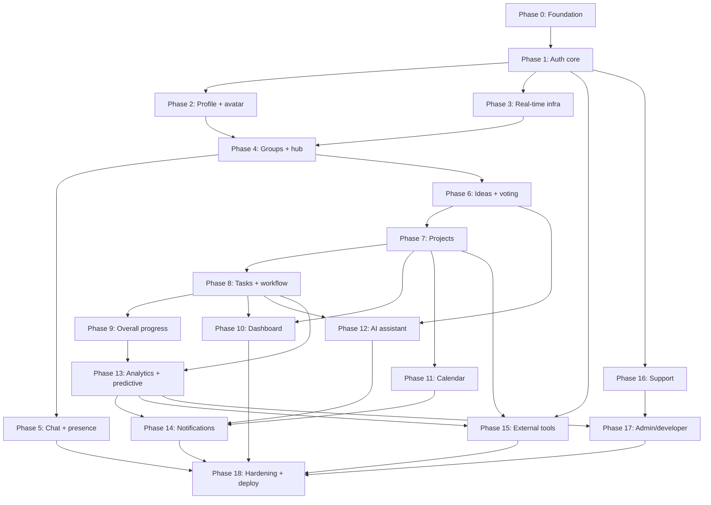

# Implementation Plan: WebSphere Platform

## Overview

This plan converts the WebSphere design into a series of incremental, test-driven coding steps for a code-generation LLM. The implementation language is **TypeScript** across the whole monorepo (NestJS API + BullMQ worker + MCP server, React/Vite web, `packages/shared`), matching the design. Property-based tests use **fast-check** (minimum 100 runs each), unit tests use the ecosystem-standard runner (Vitest/Jest), integration tests run against a containerized MySQL 8, and connector contract tests run against mocked provider responses.

Each phase is designed so the system is runnable early and grows. Every task builds on the previous ones and ends wired into the running system — no orphaned code. Each sub-task references the specific requirements/design elements it satisfies. Sub-tasks marked with `*` are optional tests that MUST NOT be implemented as part of core execution but SHOULD be written for verification.

Conventions:
- Every design correctness Property (1–25) has a dedicated fast-check sub-task, tagged `// Feature: websphere-platform, Property {n}: {text}`, placed in the phase where that behavior is built.
- All contracts (Zod schemas, TS types, Socket.IO event contracts) live in `packages/shared` so the later Expo client reuses them (NFR-9).
- Manual task-progress entry (US-031) is never implemented; instead a guard test asserts no such API/UI exists.

Checklist status: `[x]` verified implementation, `[-]` partially implemented / still needs validation or UI wiring, `[ ]` not started.

## Tasks

- [-] 1. Phase 0 — Foundation: monorepo, shared contracts, Prisma/MySQL, health
  - [x] 1.1 Bootstrap pnpm + Turborepo monorepo and app/package skeletons
    - Create `pnpm-workspace.yaml`, `turbo.json`, root `tsconfig`, ESLint/Prettier configs; scaffold `apps/web` (React+Vite+TS), `apps/api` (NestJS), `apps/worker` (BullMQ), `apps/mcp` (MCP server), `packages/shared`, `prisma/`, `docker/`; reserve empty `apps/mobile` folder
    - Wire root scripts (`build`, `lint`, `test`, `dev`) through Turborepo so all workspaces build
    - Tests to write: a smoke test per workspace that imports the entrypoint and asserts it loads
    - _Requirements: NFR 9, 10; Design: Monorepo layout, "How web-first/API-first enables the Expo phase"_
  - [x] 1.2 Establish `packages/shared` single source of truth
    - Define `Role`, `ApiError`, and DTO Zod schemas + inferred TS types; define `ServerToClientEvents`/`ClientToServerEvents` Socket.IO contracts; export a placeholder generated OpenAPI client module
    - Tests to write: unit tests that Zod schemas validate representative valid/invalid payloads and that types compile
    - _Requirements: NFR 5, 9; Design: Cross-cutting contracts (packages/shared)_
  - [x] 1.3 Author full Prisma schema, MySQL 8 connection, and initial migration
    - Implement every model from the design (User, Admin, Group, GroupMember, JoinCode, ChatMessage, Project, ProjectMember, Task, TaskDependency, TaskAssignment, TaskComment, WorkflowEvent, Idea, IdeaPoll, PollOption, Vote, CalendarEvent, Notification, NotificationPreference, PushSubscription, ConnectedTool, ToolConnection, LinkedResource, ToolUsage, AiInteraction, Embedding, AnalyticsSnapshot, SupportTicket, AuditLog, SystemSetting) with all enums, indexes, and unique constraints
    - Generate the initial migration and Prisma client
    - Tests to write (integration): apply migration to a throwaway MySQL 8, assert `@@unique([groupId,userId])`, `@@unique([pollId,voterId])`, `Project.ideaId @unique`, and email uniqueness are enforced
    - _Requirements: NFR 16, 20; Design: Data Models (Prisma model definitions), ERD_
  - [x] 1.4 Seed script and Tools_Catalog seed data
    - Create `prisma/seed.ts` seeding an Administrator account, a demo Project_Member, and the six `ConnectedTool` catalog rows (google, microsoft, trello, asana, canva, figma) with categories
    - Tests to write: unit test that seed is idempotent (re-running does not duplicate catalog rows)
    - _Requirements: US-067; Design: IntegrationsModule (Tools_Catalog), AdminModule_
  - [x] 1.5 SharedInfra services and `/health` endpoint
    - Implement `PrismaService`, `RedisService`, typed `ConfigService`, `CryptoService` (AES-GCM encrypt/decrypt with IV + auth tag), and `StorageService` (Linux instance persistent volume); bootstrap the NestJS app with a global validation pipe (Zod) and global `ApiError` exception filter; add `GET /health` checking DB + Redis
    - Tests to write: unit tests for `CryptoService` round-trip; integration test hitting `/health` with DB+Redis up
    - _Requirements: NFR 3, 5, 20; Design: SharedInfra, Error Handling (global exception filter)_
  - [x] 1.6 Docker skeleton and CI pipeline as code
    - Add Dockerfiles for api, worker, web, mcp and a base `docker/docker-compose.yml` with mysql + redis for local dev; add a CI workflow running install → lint → build → unit/property tests
    - Tests to write: CI dry-run asserts lint/build/test stages succeed on the skeleton
    - _Requirements: NFR 19, 20; Design: Architecture (Docker Compose services)_
  - [ ]* 1.7 Set up test harnesses (Vitest/Jest, fast-check, transactional MySQL test DB)
    - Configure fast-check with `{ numRuns: 100 }` default, a rolled-back-transaction test helper for Prisma, and mocked OpenAI/SES/push/provider clients
    - _Requirements: NFR 15, 16; Design: Testing Strategy_

- [-] 2. Phase 1 — Authentication core, JWT/refresh, RBAC, password lifecycle
  - [x] 2.1 Implement pure `validatePassword` policy function
    - In `AuthModule` implement rules: length ≥ 8, ≥ 1 symbol, ≥ 1 number arranged non-continuously, reject monotonic sequences (e.g. "AbCd1234", "1234", "abcd"); return `{ ok, reason }` with reason in {length, missing_symbol, missing_number, sequence}
    - _Requirements: US-006.1, 6.2; Design: AuthModule (validatePassword), Error Handling (password reasons)_
  - [ ]* 2.2 Property test for password validator
    - `// Feature: websphere-platform, Property 1: Password validator accepts exactly the compliant, non-sequential passwords`
    - Generate random strings incl. embedded monotonic sequences; assert `ok === true` iff compliant
    - _Requirements: US-006.1, 6.2; Design: Property 1_
  - [x] 2.3 User registration endpoint
    - Implement `POST /users` / `POST /auth/register` in `UsersModule`: validate required personal/academic/account fields via Zod, hash password (argon2/bcrypt), reject duplicate email, create Project_Member, return `ApiError` with `fields` on failure
    - Tests to write (integration): valid create; missing fields; invalid values; duplicate email
    - _Requirements: US-001.1–1.4, US-004.1; Design: UsersModule, Error Handling (VALIDATION_FAILED)_
  - [ ]* 2.4 Property test for registration
    - `// Feature: websphere-platform, Property 6: Registration succeeds exactly for complete, valid, non-duplicate submissions`
    - Generate random payloads (missing/invalid/duplicate); assert account created iff complete+valid+unique
    - _Requirements: US-001.2, 1.3, 1.4; Design: Property 6_
  - [x] 2.5 JWT access+refresh with token versioning, user login, admin login
    - Implement `login`, `adminLogin`, `refresh` (rotate refresh `jti` in Redis, bump on reuse), access JWT carrying `{ sub, role, tv }`; store refresh by `jti` and per-user `tokenVersion` in Redis; route by role on success; admin portal denies non-Administrators
    - Endpoints: `POST /auth/login`, `POST /auth/admin/login`, `POST /auth/refresh`
    - Tests to write (integration): valid/invalid credentials, missing fields, admin-portal rejection of non-admins, refresh rotation
    - _Requirements: US-002.1–2.4, US-003.1–3.3, NFR 2; Design: AuthModule (token model), Error Handling (AUTH_INVALID_CREDENTIALS, ADMIN_UNAUTHORIZED)_
  - [x] 2.6 RBAC guards (global JWT guard, RolesGuard, project/group-scoped guards)
    - Implement `JwtAuthGuard` (rejects `tv` mismatch), `RolesGuard` reading `@Roles()`, and `@ProjectRole()`/`@GroupRole()` guards that check membership rows; apply role changes on next request
    - Tests to write (integration): denied out-of-role and out-of-scope requests return `403 RBAC_FORBIDDEN` with no state change; role change reflected next request
    - _Requirements: US-004.1–4.3, NFR 1; Design: AuthModule (RBAC), Error Handling (RBAC_FORBIDDEN)_
  - [ ]* 2.7 Property test for RBAC deny matrix and single primary role
    - `// Feature: websphere-platform, Property 4: RBAC denies every out-of-role action and each account has exactly one primary role`
    - Generate random (role, action, membership) tuples; assert permit iff role/scope grants; every account resolves to exactly one primary role
    - _Requirements: US-004.1, 4.2; Design: Property 4_
  - [x] 2.8 Logout invalidation
    - Implement `POST /auth/logout`: delete refresh `jti`, increment `tokenVersion`, clear cached session data; guards reject invalidated tokens as `401 AUTH_UNAUTHENTICATED`
    - Tests to write (integration): post-logout access + refresh both rejected; cached session unreadable
    - _Requirements: US-007.1–7.3, NFR 4; Design: AuthModule (logout), Error Handling (AUTH_UNAUTHENTICATED)_
  - [ ]* 2.9 Property test for logout invalidation
    - `// Feature: websphere-platform, Property 2: Logout invalidates every prior token and cached session`
    - Generate random authenticated sessions; after logout assert all prior tokens rejected and session cache not readable (tv bumped)
    - _Requirements: US-007.1, 7.2, 7.3; Design: Property 2_
  - [-] 2.10 Guided reset, lockout counter, and locked-out email reset path
    - Implement `POST /auth/password/change` (requires old pw + new pw twice), `POST /auth/password/forgot` (email reset link when locked), `POST /auth/password/reset` (token completion); Redis failed-login counter with TTL flips account to `locked` at threshold → `423 ACCOUNT_LOCKED`; wrong old pw → `400 PASSWORD_INCORRECT`; no 2FA
    - Tests to write (integration): guided reset success/wrong-old/mismatch; locked account blocks guided reset; email token completes reset
    - _Requirements: US-006.3–6.6; Design: AuthModule (guidedReset/requestLockedReset), Error Handling (ACCOUNT_LOCKED, PASSWORD_INCORRECT)_
  - [ ]* 2.11 Property test for locked-out reset path
    - `// Feature: websphere-platform, Property 3: Locked-out accounts can only reset via the email link`
    - Generate random locked accounts; assert guided reset always denied and only emailed token path succeeds
    - _Requirements: US-006.5; Design: Property 3_
  - [ ]* 2.12 Unit tests for guided-reset branches
    - Cover correct old password, wrong old password, mismatched confirmation
    - _Requirements: US-006.3, 6.4; Design: Testing Strategy (unit tests)_

- [ ] 3. Checkpoint — Foundation + Auth
  - Ensure all tests pass, ask the user if questions arise.

- [-] 4. Phase 2 — Profile management and avatar upload
  - [-] 4.1 Profile view and edit
    - Implement `GET /users/me` and `PATCH /users/me` (name, email, institution, course) with Zod validation and field-level errors; build the web Profile page consuming the shared client
    - Tests to write (integration): display profile; valid edit persists + confirms; invalid edit identifies fields
    - _Requirements: US-005.1–5.3; Design: UsersModule_
  - [-] 4.2 Avatar upload to Linux instance persistent volume
    - Implement `POST /users/me/avatar` (upload → `StorageService`), persist `avatarUrl`; web upload control
    - Tests to write (integration): upload stores object and updates `avatarUrl`
    - _Requirements: US-005.1, 5.2; Design: UsersModule (avatar), SharedInfra (storage)_
  - [ ]* 4.3 Unit tests for profile validation branches
    - Invalid email/empty name rejection paths
    - _Requirements: US-005.3; Design: Testing Strategy_

- [-] 5. Phase 3 — Real-time infrastructure (Socket.IO + Redis adapter + presence)
  - [-] 5.1 Socket.IO gateway with Redis adapter and authenticated room management
    - Implement `RealtimeModule` gateway (Socket.IO 4.7+) with Redis adapter, JWT handshake auth, and `group:join`/`project:join` ack handlers using the shared event contracts
    - Tests to write (integration): authenticated connect, room join ack, unauthorized handshake rejected
    - _Requirements: NFR 7; Design: RealtimeModule, Cross-cutting contracts (Socket.IO events)_
  - [ ] 5.2 Presence registry in Redis
    - Track online users in Redis keyed by connection; expose a presence lookup service and emit `presence:update`
    - Tests to write (integration): connect/disconnect updates presence set
    - _Requirements: US-008.2, NFR 7; Design: RealtimeModule (presence), ChatModule (presence)_
  - [ ]* 5.3 Integration test for gateway + adapter delivery
    - Assert events broadcast to correct rooms across two adapter-backed sockets
    - _Requirements: NFR 7; Design: Testing Strategy (Socket.IO event tests)_

- [x] 6. Phase 4 — Groups, membership, collaboration hub
  - [x] 6.1 Group creation and join-by-code
    - Implement `POST /groups` (creator becomes Project_Leader), unique Google-Meet-style `JoinCode` generation with expiry/active flags, and `POST /groups/join` validating code; support multiple group membership
    - Tests to write (integration): create generates unique code; valid code joins; invalid/expired code → invalid-code error
    - _Requirements: US-012.1–12.4; Design: GroupsModule_
  - [ ]* 6.2 Property test for join codes
    - `// Feature: websphere-platform, Property 7: Join codes are unique and admit exactly valid, unexpired codes`
    - Generate code sets + submissions; assert uniqueness and join iff active+unexpired
    - _Requirements: US-012.1, 12.2, 12.3; Design: Property 7_
  - [x] 6.3 List my groups/roles and group details
    - Implement `GET /groups` (each group with leader/member role) and `GET /groups/:id` (members, roles, projects, activity, progress) gated to members
    - Tests to write (integration): list shows role; details denied to non-members
    - _Requirements: US-013.1, 13.2, US-014.1, 14.2; Design: GroupsModule_
  - [x] 6.4 Add member (any member) and remove member (leader-only)
    - Implement `POST /groups/:id/members` (adds as Project_Member) and `DELETE /groups/:id/members/:userId` (Project_Leader only, revokes access)
    - Tests to write (integration): non-leader removal denied and membership unchanged; leader removal revokes access
    - _Requirements: US-015.1–15.3; Design: GroupsModule, Error Handling (RBAC_FORBIDDEN)_
  - [ ]* 6.5 Property test for leader-only member removal
    - `// Feature: websphere-platform, Property 5: Member removal is leader-only`
    - Generate random (group, actor) pairs; assert removal succeeds iff actor is authorized leader, else unchanged
    - _Requirements: US-015.2, 15.3; Design: Property 5_
  - [x] 6.6 Collaboration hub aggregate
    - Implement `GET /groups/:id/hub` returning projects, tasks, ideas, voting, and chat entry points for the group, gated to members; wire the web hub shell
    - Tests to write (integration): hub aggregates group resources; non-member denied
    - _Requirements: US-017.1, 17.2; Design: GroupsModule (hub)_

- [-] 7. Phase 5 — Real-time chat and presence scoping
  - [ ] 7.1 Real-time group chat with retained history
    - Implement `/chat` namespace: `chat:send` → persist `ChatMessage` → broadcast `chat:message` to group room; `GET /groups/:id/messages?cursor=` for history; reserve WebRTC signaling events as a documented later-phase stub
    - Tests to write (integration): message delivered to group room; history returns persisted messages
    - _Requirements: US-016.1, 16.2, 16.3; Design: ChatModule_
  - [ ]* 7.2 Property test for chat history round-trip
    - `// Feature: websphere-platform, Property 8: Chat history round-trips`
    - Generate random message sequences; assert reopening returns exactly those messages in send order
    - _Requirements: US-016.1, 16.2; Design: Property 8_
  - [ ] 7.3 Presence scoped to the caller's groups
    - Filter `presence:update` so a user only sees users sharing a group; surface online users on group surfaces
    - Tests to write (integration): presence list excludes non-group users
    - _Requirements: US-008.2; Design: ChatModule (presence scoping)_
  - [ ]* 7.4 Property test for presence scoping
    - `// Feature: websphere-platform, Property 9: Presence is scoped to the caller's group`
    - Generate random online-user/group graphs; assert returned presence only includes shared-group users
    - _Requirements: US-008.2; Design: Property 9_

- [x] 8. Phase 6 — Ideas, voting, and idea-to-project conversion
  - [x] 8.1 Idea submit, view, and author-only revise
    - Implement `submit`/`list`/`revise` (`POST`/`GET`/`PATCH /groups/:id/ideas...`): member-gated submission, list with author + status, author-only pre-selection revision
    - Tests to write (integration): member submits; non-member denied; non-author edit denied
    - _Requirements: US-036.1, 36.2, US-037.1, 37.2, US-038.1, 38.2; Design: IdeasModule_
  - [x] 8.2 Poll open, voting, and real-time results
    - Implement `openPoll`, `vote` (unique `(pollId, voterId)`; re-vote updates existing row; ineligible denied), and `results`; broadcast `poll:tally` to the group room after each vote
    - Tests to write (integration): one counted vote per member; re-vote updates; ineligible denied; tally broadcast
    - _Requirements: US-041.1, 41.2, US-042.1, 42.2; Design: IdeasModule (voting)_
  - [ ]* 8.3 Property test for vote-exactly-once and tally consistency
    - `// Feature: websphere-platform, Property 12: Votes are counted exactly once per eligible member and tallies are consistent`
    - Generate random vote/re-vote/ineligible sequences; assert ≤1 counted vote per member, ineligible denied, per-option tally = distinct current voters, sum = members who voted
    - _Requirements: US-041.1, 41.2, US-042.1, 42.2; Design: Property 12_
  - [x] 8.4 Finalize winning idea into a project with preserved link
    - Implement `finalize`/`beginProjectFromIdea` (`POST /groups/:id/ideas/:ideaId/begin`, leader-only): create project from winning idea, set immutable `Idea.project`/`Project.ideaId` link, mark idea `selected`
    - Tests to write (integration): finalize creates project; link retrievable from both directions
    - _Requirements: US-018.1, 18.2, US-043.1, 43.2; Design: IdeasModule (finalize), GroupsModule (beginProjectFromIdea)_
  - [ ]* 8.5 Property test for bidirectional idea-to-project link
    - `// Feature: websphere-platform, Property 10: The idea-to-project link is preserved bidirectionally`
    - Generate random winning-idea conversions; assert project→idea and idea→project both resolve and remain stable
    - _Requirements: US-018.2, 43.2; Design: Property 10_

- [ ] 9. Checkpoint — Collaboration core (groups, chat, ideas, voting)
  - Ensure all tests pass, ask the user if questions arise.

- [-] 10. Phase 7 — Project management
  - [ ] 10.1 Create project from My Projects and Dashboard
    - Implement `POST /projects` (title, description, members, dates, deadline; optional external tools; creator → Project_Leader); expose creation from both entry points in the web app
    - Tests to write (integration): project created with members; creator is leader; optional tools associated
    - _Requirements: US-019.1–19.4; Design: ProjectsModule_
  - [ ] 10.2 List projects and project details
    - Implement `GET /projects` (each with group, role, progress, deadline, status) and `GET /projects/:id` (scope, dates, members, status, progress) gated to project members
    - Tests to write (integration): list scoping; details denied to non-members
    - _Requirements: US-020.1, 20.2, US-021.1, 21.2; Design: ProjectsModule_
  - [ ] 10.3 Edit project (leader-only) and manage deadline/status
    - Implement `PATCH /projects/:id` (leader-only; members denied) and `PATCH /projects/:id/status` (active/completed/approved states); store/display deadline in My Projects
    - Tests to write (integration): member edit denied; leader edit persists; status transitions recorded
    - _Requirements: US-022.1, 22.2, US-023.1, 23.2; Design: ProjectsModule, Error Handling (RBAC_FORBIDDEN)_
  - [ ] 10.4 Team responsibilities view
    - Implement `GET /projects/:id/team` returning members + `responsibility`; update when responsibilities change
    - Tests to write (integration): responsibilities displayed and updated
    - _Requirements: US-024.1, 24.2; Design: ProjectsModule, Data Models (ProjectMember.responsibility)_
  - [ ]* 10.5 Unit tests for project edit RBAC branch
    - Leader-allowed vs member-denied edit paths
    - _Requirements: US-022.2; Design: Testing Strategy_

- [-] 11. Phase 8 — Task management, workflow recording, real-time updates
  - [ ] 11.1 Task create/edit and assign/reassign
    - Implement `POST /projects/:id/tasks`, `PATCH /tasks/:id` (leader), `POST /tasks/:id/assign` (eligible-member check, flips prior assignment inactive, notifies assignee); reassign notifies affected members; ineligible assignment denied
    - Tests to write (integration): create/edit; assign notifies; reassign updates + notifies; ineligible denied
    - _Requirements: US-026.1, 26.2, US-027.1–27.3; Design: TasksModule_
  - [ ] 11.2 My tasks and task details
    - Implement `GET /tasks/mine` (filter/sort by project/deadline/priority/status) and `GET /tasks/:id` (description, project, assignee, assigner, deadline, priority, status, progress) gated to project members
    - Tests to write (integration): filtering/sorting; details denied to non-project-members
    - _Requirements: US-028.1, 28.2, US-029.1, 29.2; Design: TasksModule_
  - [ ] 11.3 Task status update with automatic workflow recording
    - Implement `PATCH /tasks/:id/status` (assignee; pending/ongoing/completed) that persists status, sets `startedAt`/`completedAt`, and writes a `WorkflowEvent` (status_change/task_completed/assignment_change/progress_activity) automatically — no manual tracking
    - Tests to write (integration): status change persists + writes workflow event; completion recorded
    - _Requirements: US-030.1, 30.2, US-033.1–33.4; Design: TasksModule, WorkflowModule (event recording)_
  - [ ] 11.4 Task progress tracker and no-manual-progress guard
    - Implement `GET /projects/:id/tasks/tracker` (completed/ongoing/pending counts + derived %); confirm there is no route or UI control that sets a progress percentage manually (US-031)
    - Tests to write (integration): tracker counts/derived %; a guard test asserts no `setProgress`/progress-percentage endpoint or UI control exists
    - _Requirements: US-031.1, 31.2, US-032.1, 32.2; Design: TasksModule (tracker), Scope boundaries (US-031 excluded)_
  - [ ]* 11.5 Property test for progress purity and no manual input path
    - `// Feature: websphere-platform, Property 13: Progress is a pure function of workflow/task data with no manual input path`
    - Generate random task/workflow datasets; assert progress is deterministic, depends only on that data, recompute equals fresh compute, and no manual progress API exists
    - _Requirements: US-025.1, 25.2, 31.1, 31.2, 33.1–33.4; Design: Property 13_
  - [ ] 11.6 Real-time task updates and reconnect reconciliation
    - On every status/assignment change emit `task:updated` to the project room; implement `sync:request` (cursor) → `sync:reconcile` (authoritative task states) and a disconnected/reconnecting indicator
    - Tests to write (integration): live update pushed without refresh; reconnect reconciles missed changes
    - _Requirements: US-035.1, 35.2, NFR 18; Design: TasksModule (live updates), Error Handling (reconnect)_
  - [ ]* 11.7 Property test for reconnect reconciliation
    - `// Feature: websphere-platform, Property 20: Reconnect reconciles to authoritative server state`
    - Generate random task-change sequences during disconnect; assert reconciled client state equals server state
    - _Requirements: US-035.1, 35.2; Design: Property 20_
  - [ ] 11.8 Per-member task analytics
    - Implement `GET /projects/:id/tasks/by-member` deriving completed/ongoing/pending per member from task + progress data
    - Tests to write (integration): per-member breakdown matches underlying data
    - _Requirements: US-034.1, 34.2; Design: TasksModule (by-member)_

- [-] 12. Phase 9 — Overall project progress via workflow function
  - [ ] 12.1 Computed project progress read model
    - Implement `GET /projects/:id/progress` computing overall progress from tasks + workflow events (pure function in `WorkflowModule`); recompute on change; return on-track indication
    - Tests to write (integration): progress reflects task completion; recompute on change; on-track flag correct
    - _Requirements: US-025.1–25.3, NFR 15; Design: ProjectsModule (progress), WorkflowModule_

- [ ] 13. Checkpoint — Projects + Tasks + Progress
  - Ensure all tests pass, ask the user if questions arise.

- [-] 14. Phase 10 — Academic dashboard
  - [ ] 14.1 Dashboard summary and glance counts
    - Implement the dashboard aggregate (recent projects, my tasks, calendar events, upcoming deadlines, team activity, progress overview, announcements, milestones) and glance counts (active projects, pending tasks, ideas submitted)
    - Tests to write (integration): summary aggregates correct data; glance counts accurate
    - _Requirements: US-008.1, 8.3, US-009.1–9.3, US-010.1, 10.2; Design: DashboardModule_
  - [ ] 14.2 Group-scoped online users and live previews
    - Show online users limited to the student's group; render upcoming-deadline previews, notifications, and recent collaboration activity; update on underlying changes via realtime events
    - Tests to write (integration): online users group-scoped; previews update on change
    - _Requirements: US-008.2, 8.4, US-011.1, 11.2; Design: DashboardModule_

- [-] 15. Phase 11 — Calendar and scheduling
  - [ ] 15.1 Calendar view/navigation with project/task date hints
    - Implement `GET /calendar?from=&to=` returning events plus projected project-deadline/task-timeline hints (colored, clickable), and period navigation + return-to-today; hints update automatically when dates change
    - Tests to write (integration): navigation returns period; project/task hints projected live
    - _Requirements: US-048.1–48.3, US-049.1, 49.2; Design: CalendarModule_
  - [ ] 15.2 Create and manage calendar events
    - Implement `POST /calendar/events` (optional project link), `PATCH /calendar/events/:id`, `DELETE /calendar/events/:id` with project-event authorization
    - Tests to write (integration): create with/without project; edit persists; delete removes; unauthorized project-event modify denied
    - _Requirements: US-050.1, 50.2, US-051.1–51.3; Design: CalendarModule_
  - [ ] 15.3 Upcoming schedules and deadline push/email triggers
    - Implement `GET /calendar/upcoming` (date, project, urgency); emit upcoming/lapsed-deadline domain events into the notification pipeline for push + email (consumed by Phase 14)
    - Tests to write (integration): upcoming list with urgency; deadline event enqueues push+email intent
    - _Requirements: US-052.1, 52.2; Design: CalendarModule, NotificationsModule (deadline pipeline)_
  - [ ]* 15.4 Unit test for calendar event authorization branch
    - Authorized vs unauthorized project-related event modification
    - _Requirements: US-051.3; Design: Testing Strategy (unit tests)_

- [-] 16. Phase 12 — AI assistant (OpenAI + RAG + MCP + guardrails)
  - [ ] 16.1 AI orchestrator, @helper, academic guardrails, and multimodal rejection
    - Implement `AiOrchestrator.ask` and `POST /ai/ask`: OpenAI chat integration, academic-only system prompt, OpenAI moderation on input, safe refusal for non-academic prompts, and rejection of multimodal input with `400 AI_INPUT_UNSUPPORTED` before any model call; persist `AiInteraction`
    - Tests to write (integration, mocked OpenAI): academic answer; non-academic refusal; multimodal rejected pre-call
    - _Requirements: US-044.1–44.3, NFR 13; Design: AiModule (orchestration, guardrails)_
  - [ ]* 16.2 Property test for multimodal input rejection
    - `// Feature: websphere-platform, Property 25: Non-text (multimodal) AI input is rejected before any model call`
    - Generate random requests incl. multimodal parts; assert rejection precedes any OpenAI call; only text reaches the model
    - _Requirements: US-039.2, 44.2; Design: Property 25_
  - [ ] 16.3 RAG embeddings and scoped retrieval
    - Implement `Embedding` writes for project/group/task/idea text and cosine top-k retrieval behind an `EmbeddingStore` interface, RBAC-scoped to the caller; graceful ungrounded/refusal fallback on retrieval failure
    - Tests to write (integration): retrieval returns only in-scope snippets; failure degrades safely
    - _Requirements: US-044.1, NFR 12; Design: AiModule (RAG store)_
  - [ ] 16.4 MCP server and grounded recommendations
    - Implement `apps/mcp` read-only tools (`listProjects`, `listTasks`, `listIdeas`, `getToolsCatalog`) constrained to caller scope; implement `POST /ai/recommendations` grounding external-tool recommendations in the current Tools_Catalog
    - Tests to write (integration, stub MCP): recommendations only reference catalog tools; MCP never returns out-of-scope rows
    - _Requirements: US-046.1–46.3, NFR 12; Design: AiModule (MCP server), IntegrationsModule (Tools_Catalog)_
  - [ ] 16.5 Idea AI suggestions (accept/reject/revise) and merge
    - Implement `POST /ideas/:id/ai/suggest` (returns suggestions, never mutates), `POST /ai/ideas/generate` (grounded ideas + merge); author applies changes only via explicit `PATCH /ideas/:id` accept/revise; no auto-replace
    - Tests to write (integration): suggest never mutates; accept/reject/revise apply only the selected action; merge combines ideas
    - _Requirements: US-039.1, 39.2, US-040.1–40.3, US-045.1, 45.2; Design: IdeasModule (AI review), AiModule_
  - [ ]* 16.6 Property test for AI never auto-replacing an idea
    - `// Feature: websphere-platform, Property 11: AI never auto-replaces an idea`
    - Generate random ideas + suggestions; assert idea changes only via explicit author accept/revise and only the selected action applies
    - _Requirements: US-040.2, 40.3; Design: Property 11_
  - [ ] 16.7 Planning/decision guidance, RBAC-bound function calling, graceful degradation
    - Implement `POST /ai/planning` (task-planning/workflow suggestions + decision support); function-calling actions execute only within caller RBAC via service layer; on OpenAI failure return `503 AI_UNAVAILABLE` and hide AI affordances in the SPA while core features work
    - Tests to write (integration): planning suggestions; function call blocked outside RBAC; AI_UNAVAILABLE degradation
    - _Requirements: US-047.1, 47.2, NFR 14; Design: AiModule (function calling, degradation)_

- [-] 17. Phase 13 — Workflow analytics and explainable predictive monitoring
  - [ ] 17.1 Completion-rate and overall-efficiency KPIs (pure)
    - Implement `taskCompletionRate = completed/max(total,1)` and `overallEfficiency = onTimeCompleted/max(totalCompleted,1)` as pure functions in `WorkflowModule`
    - _Requirements: US-053.1, 53.2, NFR 15; Design: WorkflowModule (formulas)_
  - [ ]* 17.2 Property test for bounded completion rate and efficiency
    - `// Feature: websphere-platform, Property 14: Completion rate and overall efficiency are bounded ratios`
    - Generate random task sets; assert both equal their formulas and lie within [0,1]
    - _Requirements: US-053.1, 53.2; Design: Property 14_
  - [ ] 17.3 Member performance KPIs
    - Implement per-member `{ tasksCompleted, onTimePct, avgCycleTime, contributionShare }` from task/progress data; `GET /projects/:id/analytics/members`
    - _Requirements: US-055.1, 55.2; Design: WorkflowModule (memberPerformance)_
  - [ ]* 17.4 Property test for member contribution consistency
    - `// Feature: websphere-platform, Property 15: Member contribution shares are consistent`
    - Generate random completed-task distributions; assert each onTimePct in [0,1] and contribution shares sum to 1
    - _Requirements: US-055.1, 55.2; Design: Property 15_
  - [ ] 17.5 Bottleneck detection and Blast_Radius
    - Implement bottleneck `{ expectedDuration, actualDuration, delayDays=max(0,actual-expected), blastRadius=downstreamDependents+affectedMembers }` from the task-dependency graph; `GET /projects/:id/analytics/bottlenecks`
    - _Requirements: US-056.1, 56.2; Design: WorkflowModule (bottleneck), Data Models (TaskDependency)_
  - [ ]* 17.6 Property test for bottleneck delay and Blast_Radius
    - `// Feature: websphere-platform, Property 16: Bottleneck delay is non-negative and Blast_Radius matches the dependency graph`
    - Generate random durations + dependency graphs; assert delayDays = max(0, actual-expected) ≥ 0 and blastRadius matches graph counts
    - _Requirements: US-056.1, 56.2; Design: Property 16_
  - [ ] 17.7 Risk_Score and Risk_Level
    - Implement `riskScore = clamp(0,100, w1*remainingWorkVsTimeLeft + w2*(1-normalizedVelocity) + w3*normalizedOverdueBlocked)` and monotonic `riskLevel` thresholds (on-track <40, at-risk 40–70, critical >70); `GET /projects/:id/risk` with counts/scores/levels
    - _Requirements: US-058.1, 58.2, US-059.1, 59.2; Design: WorkflowModule (riskScore/riskLevel)_
  - [ ]* 17.8 Property test for bounded risk score and monotonic level
    - `// Feature: websphere-platform, Property 17: Risk_Score is bounded and Risk_Level is monotonic in the score`
    - Generate random inputs + score pairs; assert score in [0,100] and s1≤s2 ⇒ level(s1) not more severe than level(s2)
    - _Requirements: US-059.1, 59.2; Design: Property 17_
  - [ ] 17.9 Predicted completion date and contributing factors
    - Implement `velocity = completedInWindow/windowDays`, `predictedDate = now + ceil(remaining/max(velocity,epsilon))`, `deltaVsDeadline = predictedDate - originalDeadline`, and factor identification; `GET /projects/:id/prediction`
    - _Requirements: US-060.1, 60.2; Design: WorkflowModule (predictedDate)_
  - [ ]* 17.10 Property test for predicted-date monotonicity
    - `// Feature: websphere-platform, Property 18: Predicted completion date is monotonic in remaining work`
    - Generate random positive velocities + remaining work; assert predictedDate ≥ now, increasing remaining work never earlier, delta = predictedDate - deadline
    - _Requirements: US-060.1, 60.2; Design: Property 18_
  - [ ] 17.11 Corrective recommendations mapped to risks/bottlenecks
    - Implement `mapRiskToActions(riskLevel, bottlenecks)` (adjust deadline / reassign / add support / schedule review); `GET /projects/:id/recommendations`
    - _Requirements: US-061.1, 61.2; Design: WorkflowModule (recommendations)_
  - [ ]* 17.12 Property test for recommendation mapping
    - `// Feature: websphere-platform, Property 19: Every corrective recommendation maps to a real risk or bottleneck`
    - Generate random snapshots; assert no orphan recommendations and at-risk/critical yields ≥1 recommendation
    - _Requirements: US-061.1, 61.2; Design: Property 19_
  - [ ] 17.13 Analytics dashboard aggregate, trends, summary, and Chart.js rendering
    - Implement `GET /projects/:id/analytics` (Overall Efficiency, Bottlenecks Detected, Tasks Completed, completion rate, member performance, bottleneck analysis, connected-tool usage, workflow summary), `GET .../trends`, `GET .../summary`; render with Chart.js 4 in the web app
    - Tests to write (integration): aggregate composition; trends compare periods; summary + recommended actions present
    - _Requirements: US-053.1, 53.2, US-054.1, 54.2, US-057.1, 57.2; Design: WorkflowModule endpoints, Architecture (Chart.js)_
  - [ ] 17.14 BullMQ scheduled recompute into analytics_snapshots
    - Implement `recompute-analytics` queue (triggered by workflow events + cron) writing idempotent `AnalyticsSnapshot` read-model rows; delay-risk detection enqueues notifications
    - Tests to write (integration): recompute is idempotent per (entity, window); snapshot reflects latest data
    - _Requirements: US-058.1, US-064.2, NFR 8, 15; Design: WorkflowModule (job pipeline), JobsModule_

- [ ] 18. Checkpoint — Dashboard + Calendar + AI + Analytics
  - Ensure all tests pass, ask the user if questions arise.

- [-] 19. Phase 14 — Notifications
  - [ ] 19.1 Notification center and in-app deep-linked delivery
    - Implement `GET /notifications` (message, timestamp, type, read), `PATCH /notifications/:id/read`, and `InAppChannel` that persists `Notification` (source of truth) and emits `notification:new`; resolve `relatedId`/`relatedType` deep links
    - Tests to write (integration): center lists notifications; in-app emit on domain events; deep-link resolves to record
    - _Requirements: US-062.1, 62.2, US-063.1, 63.2; Design: NotificationsModule (pipeline)_
  - [ ] 19.2 Email + web push channels, fan-out, and deadline/predictive alerts
    - Implement `EmailChannel` (AWS SES via SMTP), `WebPushChannel` (VAPID + service worker + `POST /push/subscribe`), and a BullMQ fan-out queue with retry/backoff; deliver deadline reminders and delay-risk alerts via email + push even when the app is closed; prune `410 Gone` subscriptions
    - Tests to write (integration, mocked SES/push): deadline + delay-risk fan-out to email/push; retry/backoff; dead subscription pruned
    - _Requirements: US-064.1, 64.2, US-065.1, 65.2, NFR 8; Design: NotificationsModule (channels), Error Handling (notification delivery)_
  - [ ] 19.3 Notification preferences and channel selection
    - Implement `GET/PUT /notifications/preferences` (tasks, deadlines, group activity, AI suggestions, email/push toggles); channel selection consults preferences per type
    - Tests to write (integration): preferences persist; selection matches enabled channels
    - _Requirements: US-066.1, 66.2; Design: NotificationsModule (preferences)_
  - [ ]* 19.4 Property test for channel selection
    - `// Feature: websphere-platform, Property 21: Channel selection matches type and preferences regardless of connection state`
    - Generate random (type, preference) combos; assert selected channels equal enabled set, and deadline/delay-risk select email+push (when enabled) regardless of app-open state
    - _Requirements: US-052.2, 64.1, 64.2, 65.1, 65.2, 66.1, 66.2; Design: Property 21_

- [-] 20. Phase 15 — External tools (connector framework + six adapters)
  - [ ] 20.1 Connector framework, registry, and catalog
    - Implement the `Connector` interface, `ConnectorRegistry`, and `GET /integrations/catalog` returning supported tools (Canva, Figma, MS 365, Google Drive/Docs, Trello, Asana) with categories
    - Tests to write (integration): catalog lists all six with categories
    - _Requirements: US-067.1, 67.3; Design: IntegrationsModule (Connector, registry)_
  - [ ] 20.2 OAuth2 flow with AES-GCM encrypted token storage
    - Implement `GET /integrations/:provider/authorize` and `/callback` (validate `state`; no partial connection on failure) storing tokens as AES-GCM ciphertext + IV + auth tag via `CryptoService`; decrypt only in-adapter
    - Tests to write (integration): authorize/callback stores encrypted tokens; invalid state → `400 OAUTH_EXCHANGE_FAILED` with no persistence
    - _Requirements: US-067.2, NFR 3; Design: IntegrationsModule (OAuth2), Error Handling (OAUTH_EXCHANGE_FAILED)_
  - [ ]* 20.3 Property test for OAuth token encryption round-trip
    - `// Feature: websphere-platform, Property 22: OAuth tokens are never stored in plaintext and round-trip losslessly`
    - Generate random token strings; assert stored record contains no plaintext substring and AES-GCM decryption returns the exact original
    - _Requirements: US-067.2, NFR 3; Design: Property 22_
  - [ ] 20.4 Link, launch, sync, status, and usage feeding analytics
    - Implement `POST /integrations/:provider/link`, `GET /integrations/links/:id/launch` (deep link; expired → `409 INTEGRATION_RECONNECT_REQUIRED`), `GET /integrations/connections` (status + sync activity), `POST /integrations/connections/:id/sync`; record `ToolUsage` surfaced to analytics
    - Tests to write (integration): link records target; launch opens in context; sync updates status; usage logged
    - _Requirements: US-068.1, 68.2, US-069.1, 69.2; Design: IntegrationsModule (link/launch/sync)_
  - [ ] 20.5 Implement all six provider adapters
    - Implement Google (Drive/Docs), Microsoft 365 (Graph), Trello, Asana, Canva, and Figma adapters behind the common `Connector` interface (authorizeUrl, exchangeCode, refresh, sync, link, launchUrl)
    - Tests to write: per-adapter unit tests for URL building and token handling
    - _Requirements: US-067.1, 67.2, US-068.1, 68.2, US-069.1, 69.2; Design: IntegrationsModule (six adapters)_
  - [ ]* 20.6 Contract tests for the six adapters
    - Verify each adapter conforms to the `Connector` contract using mocked provider responses; assert encrypted-only token storage and correct expired/reconnect states
    - _Requirements: US-067, 068, 069, NFR 3; Design: Testing Strategy (contract tests)_
  - [ ] 20.7 Token-refresh BullMQ job
    - Implement a job that refreshes tokens before expiry where supported; flag connections `expired` and prompt reconnect where refresh is unavailable/fails
    - Tests to write (integration): refresh succeeds; failure flags expired
    - _Requirements: US-069, NFR 8; Design: IntegrationsModule (refresh), Error Handling (token expiry)_

- [-] 21. Phase 16 — Support and ticketing
  - [ ] 21.1 Submit categorized support ticket
    - Implement `POST /support/tickets` requiring a valid category (account_reactivation, account_deletion, password_concern, bug_report, other); reject missing category
    - Tests to write (integration): stored with valid category; missing category rejected
    - _Requirements: US-070.1, 70.2; Design: SupportModule_
  - [ ]* 21.2 Property test for ticket category requirement
    - `// Feature: websphere-platform, Property 23: Support ticket submission requires a valid category`
    - Generate random submissions with/without category; assert stored iff valid category, else rejected
    - _Requirements: US-070.1, 70.2; Design: Property 23_
  - [ ] 21.3 Admin ticket processing and statuses
    - Implement `GET /admin/support/tickets` and `PATCH /admin/support/tickets/:id` (record response; status pending/in_progress/resolved/rejected)
    - Tests to write (integration): response recorded; status transitions applied
    - _Requirements: US-071.1, 71.2; Design: AdminModule/SupportModule_

- [-] 22. Phase 17 — Administrator / developer module
  - [ ] 22.1 Monitoring dashboard and system health
    - Implement `GET /admin/monitoring` (metrics, user activity, active projects, system health, availability indicators)
    - Tests to write (integration): metrics/health composition
    - _Requirements: US-072.1, 72.2; Design: AdminModule_
  - [ ] 22.2 Account lifecycle management
    - Implement `GET /admin/users` and `PATCH /admin/users/:id` (view/edit/deactivate/remove/reactivate/suspend; reactivation from approved support request)
    - Tests to write (integration + unit): each lifecycle transition applies to access; reactivation path
    - _Requirements: US-073.1–73.3; Design: AdminModule, Testing Strategy (lifecycle transitions)_
  - [ ] 22.3 Audit/system logs view
    - Implement `AuditLog` writes across modules (via the global exception filter and domain events) and `GET /admin/logs` returning time, activity, module, severity, description
    - Tests to write (integration): logs include all required fields
    - _Requirements: US-074.1, 74.2; Design: AdminModule, Error Handling (audit logging)_
  - [ ]* 22.4 Property test for audit log required fields
    - `// Feature: websphere-platform, Property 24: Every audit log entry carries the required fields`
    - Generate random logged events; assert each persisted record has timestamp, module, activity, severity, description
    - _Requirements: US-074.1, 74.2; Design: Property 24_
  - [ ] 22.5 System configuration and maintenance mode
    - Implement `GET/PUT /admin/settings` (notification rules, inactivity limits, system updates, maintenance mode) persisting `SystemSetting`; enabling maintenance mode applies platform-wide
    - Tests to write (integration): settings persist; maintenance mode gates the platform
    - _Requirements: US-075.1, 75.2; Design: AdminModule (settings)_

- [ ] 23. Checkpoint — Notifications + Integrations + Support + Admin
  - Ensure all tests pass, ask the user if questions arise.

- [-] 24. Phase 18 — Hardening and deployment
  - [ ] 24.1 Production Docker Compose for Lightsail, SES wiring, HTTPS
    - Finalize `docker/docker-compose.yml` with api, worker, web+nginx (TLS termination, static + reverse proxy), mysql, redis, and mcp services; wire SES SMTP env; enforce HTTPS at nginx
    - Tests to write: compose config validation / smoke bring-up asserting all services start and `/health` is reachable over TLS
    - _Requirements: NFR 5, 19, 20; Design: Architecture (Docker Compose, nginx)_
  - [ ]* 24.2 End-to-end critical-flow test
    - Automate: register → create/join group → submit ideas → open poll → vote → finalize winning idea → create project → create/assign tasks → update task status → view analytics/risk/prediction → receive notifications; assert idea→project link, automatic workflow recording, derived progress, and live updates
    - _Requirements: US-001, 012, 018, 019, 026, 030, 035, 043, 053, 060, 062; Design: Testing Strategy (E2E)_
  - [ ]* 24.3 Security-sensitive verification suite
    - Assert RBAC enforcement across endpoints (incl. scoped + leader-only removal), post-logout token/refresh rejection + token-version bump + cache invalidation, no plaintext OAuth token persisted with lossless AES-GCM round-trip, and HTTPS transport with boundary input validation
    - _Requirements: NFR 1, 3, 4, 5; Design: Testing Strategy (security-sensitive verification)_
  - [ ] 24.4 Scaffold `apps/mobile` Expo shell consuming `packages/shared`
    - Create a minimal Expo (React Native) app that imports the shared client, Zod types, and Socket.IO event contracts and performs an authenticated `/health` + login call to prove cross-platform readiness (no feature parity)
    - Tests to write: a build/smoke test that the Expo shell compiles and resolves `packages/shared`
    - _Requirements: NFR 9, 10; Design: "How web-first/API-first enables the Expo phase", Scope boundaries_

- [ ] 25. Final checkpoint — full system
  - Ensure all tests pass, ask the user if questions arise.

## Notes

- Tasks marked with `*` are optional test sub-tasks and can be skipped for a faster MVP; they are NOT implemented during core execution but SHOULD be written for verification.
- Each task references specific requirements (granular sub-requirements) and design elements for traceability.
- All 25 correctness Properties have a dedicated fast-check sub-task (min 100 runs), tagged in the required comment format, placed in the phase where the behavior is built: Properties 1–4,6 (Phase 1 Auth), 5,7 (Phase 4 Groups), 8,9 (Phase 5 Chat/Presence), 10,12 (Phase 6 Ideas/Voting), 13,20 (Phase 8 Tasks), 11,25 (Phase 12 AI), 14–19 (Phase 13 Analytics), 21 (Phase 14 Notifications), 22 (Phase 15 Integrations), 23 (Phase 16 Support), 24 (Phase 17 Admin).
- US-031 is intentionally never implemented; task 11.4 asserts no manual progress API/UI exists (Property 13 also enforces this).
- Checkpoints ensure incremental validation; the system is runnable from Phase 0 and grows each phase.
- The Expo mobile client and WebRTC audio/video remain later phases; only their enabling architecture (shared contracts, Socket.IO signaling seam, Expo shell) is built here.

## Task Dependency Graph

The waves below schedule leaf sub-tasks for parallel execution. Tasks in the same wave are independent; a wave runs only after all earlier waves complete. Checkpoints and top-level tasks are not included.

```json
{
  "waves": [
    { "id": 0, "tasks": ["1.1"] },
    { "id": 1, "tasks": ["1.2", "1.6"] },
    { "id": 2, "tasks": ["1.3", "1.7"] },
    { "id": 3, "tasks": ["1.4", "1.5"] },
    { "id": 4, "tasks": ["2.1"] },
    { "id": 5, "tasks": ["2.2", "2.3"] },
    { "id": 6, "tasks": ["2.4", "2.5"] },
    { "id": 7, "tasks": ["2.6", "2.8"] },
    { "id": 8, "tasks": ["2.7", "2.9", "2.10"] },
    { "id": 9, "tasks": ["2.11", "2.12", "4.1", "5.1"] },
    { "id": 10, "tasks": ["4.2", "4.3", "5.2", "5.3"] },
    { "id": 11, "tasks": ["6.1"] },
    { "id": 12, "tasks": ["6.2", "6.3", "6.4"] },
    { "id": 13, "tasks": ["6.5", "6.6", "7.1"] },
    { "id": 14, "tasks": ["7.2", "7.3"] },
    { "id": 15, "tasks": ["7.4", "8.1"] },
    { "id": 16, "tasks": ["8.2", "8.4"] },
    { "id": 17, "tasks": ["8.3", "8.5", "10.1"] },
    { "id": 18, "tasks": ["10.2", "10.3", "10.4"] },
    { "id": 19, "tasks": ["10.5", "11.1"] },
    { "id": 20, "tasks": ["11.2", "11.3"] },
    { "id": 21, "tasks": ["11.4", "11.6", "11.8"] },
    { "id": 22, "tasks": ["11.5", "11.7", "12.1"] },
    { "id": 23, "tasks": ["14.1", "15.1", "16.1", "16.3"] },
    { "id": 24, "tasks": ["14.2", "15.2", "16.2", "16.4"] },
    { "id": 25, "tasks": ["16.5", "16.7"] },
    { "id": 26, "tasks": ["16.6", "17.1", "17.3", "17.5", "17.7", "17.9", "17.11"] },
    { "id": 27, "tasks": ["17.2", "17.4", "17.6", "17.8", "17.10", "17.12"] },
    { "id": 28, "tasks": ["17.13", "17.14"] },
    { "id": 29, "tasks": ["19.1", "19.3"] },
    { "id": 30, "tasks": ["19.2", "19.4", "15.3", "15.4"] },
    { "id": 31, "tasks": ["20.1", "20.2"] },
    { "id": 32, "tasks": ["20.3", "20.4", "20.5"] },
    { "id": 33, "tasks": ["20.6", "20.7"] },
    { "id": 34, "tasks": ["21.1", "21.3", "22.1", "22.2", "22.5"] },
    { "id": 35, "tasks": ["21.2", "22.3"] },
    { "id": 36, "tasks": ["22.4"] },
    { "id": 37, "tasks": ["24.1", "24.4"] },
    { "id": 38, "tasks": ["24.2", "24.3"] }
  ]
}
```

Phase-level dependency view (Mermaid):


